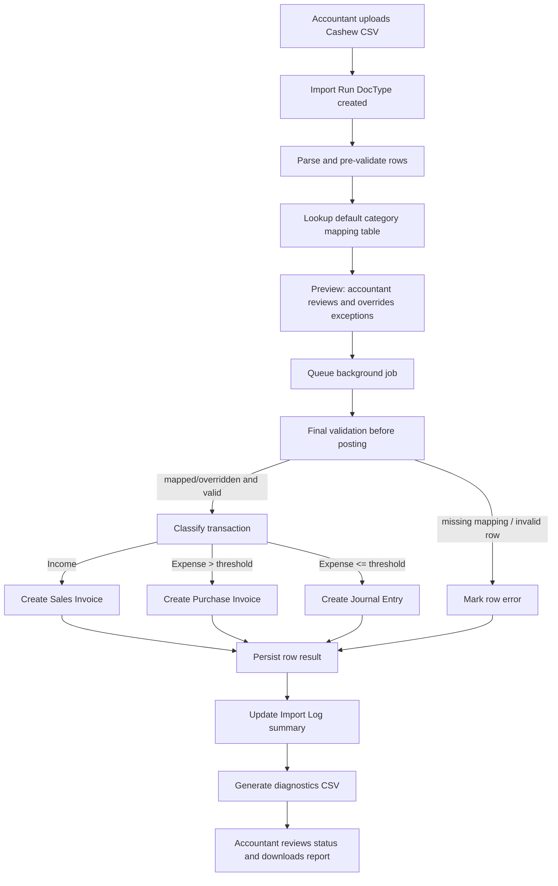

# Data Flow

## Notes

- Processing is asynchronous via queue for reliability at 100-1000 rows/file.
- Idempotency guard prevents reposting the same source transaction on re-run.
- Default mapping comes from mapping table; accountant can override in preview for exceptions.
- Rows with unresolved validation or mapping errors are blocked from posting and reported in diagnostics.
