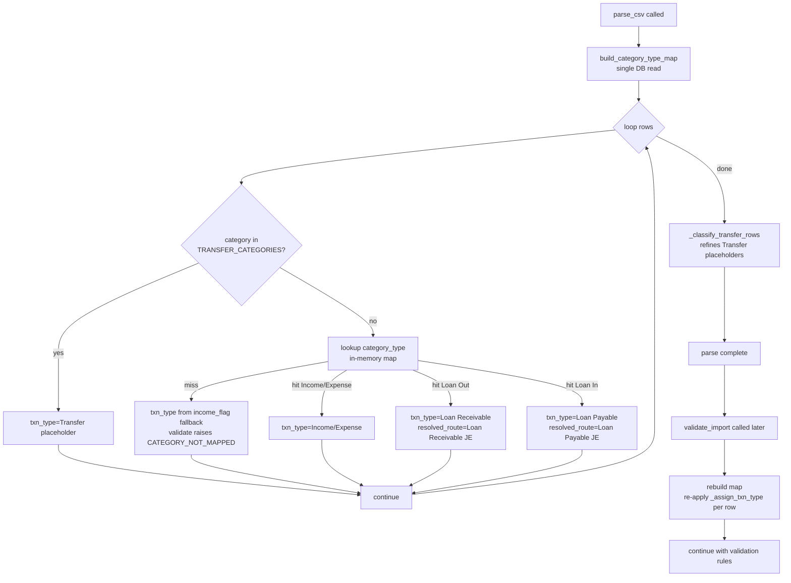

# Spec: c002 — parser-loan-routing

Story: [c002-story.md](./c002-story.md)
Architecture: f006 Decision 1 (4-route table). Builds on c001 schema.
TD decisions: lookup runs at parser entry (one DB read), shared helper `category_lookup.py` so parser + mapping read the same source, validate-time re-evaluation chosen so post-edit category_type changes flow through without CSV re-upload (option b).

## Overview

Parser today sets `txn_type` from `(category ∈ TRANSFER_CATEGORIES, income_flag)` only — no DB lookup. After c002, parser additionally consults Cashew Category Mapping to read `category_type` and applies Decision 1's 4-route table. Feeds c003 (mapping engine simplification) and c004 (posting handler), both downstream of an authoritative `txn_type`.

## Component Detail

```yaml
id: c002
name: parser-loan-routing
type: backend-module
depends_on: [c001]
```

## TD Decisions

1. **Where lookup runs:** parser entry point `parse_csv` builds a `category_type_map: dict[(cashew_category, cashew_sub_category) -> dict]` once (single `frappe.get_all` against Cashew Settings child table). Per-row `_assign_txn_type` reads from in-memory dict.
2. **Lookup key:** `(cashew_category, cashew_sub_category)` with fallback to `(cashew_category, "")` — matches existing `mapping._build_category_map` semantics; single Cashew Category Mapping with empty sub_category acts as catch-all under that category.
3. **Shared helper:** new `cashew_integration/importer/category_lookup.py::build_category_type_map()`. Both `parser.py` and `mapping.py` import from here. Single source of truth.
4. **Fallback when category not in Mapping:** keep today's behavior — `txn_type` from `income_flag` (Income/Expense). Validate stage raises `CATEGORY_NOT_MAPPED`. Parser does not raise.
5. **`resolved_route` for Loan rows is set by parser.** Income/Expense `resolved_route` keeps being set by mapping engine (depends on amount × posting threshold). Loan routes are unambiguous from `category_type`; threshold-fork doesn't apply.
6. **Validate-time re-evaluation (option b):** `validate_import` re-applies `_assign_txn_type` over each row using the current `category_type_map`. Catches the case "user edited category_type after parse but before queue_run". Cost: one extra map build + per-row dict lookup at validate time. Prevents stale-routing class of bugs.

## Function Spec — `_assign_txn_type`

```python
def _assign_txn_type(row: dict, category_map: dict) -> None:
    """Sets row['txn_type']; for Loan routes also sets row['resolved_route'].
    Called from parser main loop after row['category'] / ['sub_category'] are normalized,
    AND from validate_import per-row (option b — re-evaluate against current mapping).
    """
    category = row["category"]
    sub      = row["sub_category"]
    income   = row["income_flag"]

    # Transfer-family — preserved from f001
    if category in TRANSFER_CATEGORIES:
        row["txn_type"] = "Transfer"   # refined later by _classify_transfer_rows
        return

    # Mapped category — apply Decision 1 routing
    mapping = category_map.get((category, sub)) or category_map.get((category, ""))
    if mapping is None:
        # Unmapped — fall back to direction-based guess.
        # validate_import will raise CATEGORY_NOT_MAPPED on this row.
        row["txn_type"] = "Income" if income == "true" else "Expense"
        return

    ctype = mapping["category_type"]
    if ctype == "Income":
        row["txn_type"] = "Income"
    elif ctype == "Expense":
        row["txn_type"] = "Expense"
    elif ctype == "Loan Out":
        row["txn_type"]       = "Loan Receivable"
        row["resolved_route"] = "Loan Receivable JE"
    elif ctype == "Loan In":
        row["txn_type"]       = "Loan Payable"
        row["resolved_route"] = "Loan Payable JE"
    else:
        # Defensive: future enum values land here. Falls back to direction-based.
        row["txn_type"] = "Income" if income == "true" else "Expense"
```

## Decision 1 Routing Table — Verification Matrix

| `category_type` | `income_flag` | `txn_type` | `resolved_route` set by parser |
|---|---|---|---|
| Income | true | Income | — (mapping engine sets SI/JE per threshold) |
| Income | false | Income | — (mapping engine; refund/credit-note path) |
| Expense | false | Expense | — (mapping engine sets PI/JE per threshold) |
| Expense | true | Expense | — (mapping engine; refund path) |
| Loan Out | false (lent) | Loan Receivable | Loan Receivable JE |
| Loan Out | true (repayment received) | Loan Receivable | Loan Receivable JE |
| Loan In | true (borrowed) | Loan Payable | Loan Payable JE |
| Loan In | false (loan paid back) | Loan Payable | Loan Payable JE |

## Data Flow



## Files Affected

| file | change |
|---|---|
| `cashew_integration/importer/category_lookup.py` | NEW. `build_category_type_map() -> dict[tuple[str, str], dict]`. Returns Cashew Category Mapping rows keyed by `(cashew_category, cashew_sub_category)` with fields incl. `category_type`, `default_account`, `requires_party`, `is_active` (filter is_active=1). |
| `cashew_integration/importer/parser.py` | Build map at `parse_csv` entry. Replace existing initial-pass `txn_type` block with `_assign_txn_type(row, category_map)` helper. Existing `_classify_transfer_rows` pass unchanged. |
| `cashew_integration/importer/mapping.py` | Refactor `_build_category_map` to delegate to / use the shared helper. No behavior change for downstream callers. |
| `cashew_integration/importer/validation.py` (or wherever `validate_import` lives) | Per-row pass: rebuild map, re-apply `_assign_txn_type` before existing validation rules run. Captures category_type edits between parse and validate. |

## Permissions

No change. Parser is invoked from API methods (`validate_import`, `queue_run`) under the calling user's permissions.

## Frappe Hooks

None.

## Notes / Gotchas

- **Lookup-key fallback `(category, "")`** preserves existing behavior: a Cashew Category Mapping with empty `cashew_sub_category` acts as catch-all for all sub_categories under that category. Critical — most rows in real Cashew exports have empty `subcategory name`.
- **`resolved_route` for Income/Expense is NOT set by parser.** Mapping engine continues to set it based on amount × posting threshold (SI vs JE for Income; PI vs JE for Expense, per system-arch "Posting Targets by Transaction Type").
- **`is_active=0` mappings ignored.** `build_category_type_map` filters to `is_active=1`. An inactive mapping → row falls back to `CATEGORY_NOT_MAPPED` path (matches existing engine behavior).
- **Idempotency unaffected.** `source_hash` is computed from CSV content; `txn_type` / `resolved_route` are not part of the hash.
- **Validate-time re-evaluation (option b) decided.** No CSV re-upload required after a category_type edit — validate_import refreshes routing on each call. Tiny cost.
- **Backwards compat.** Already-posted runs are not re-parsed or re-validated. Their stored `txn_type` is what was assigned at original parse time.
- **No new error codes.**
- **Defensive `else` branch** in `_assign_txn_type` handles future `category_type` enum values gracefully — falls back to direction-based instead of crashing.

## Testing Notes (Dev Hand-off)

- Unit tests for `_assign_txn_type` covering the 8-row matrix above + Transfer placeholder + unmapped-category fallback + inactive-mapping fallback + future-enum defensive path.
- Integration test: parse a CSV with one Loan Out + one Loan In + one Income + one Expense + one Balance Correction pair. Assert `txn_type` and `resolved_route` per row.
- Regression: existing `test_parser` must still pass (Income/Expense/Transfer/External Transfer/Adjustment classification unchanged for non-loan rows).
- Validate-time re-eval test: parse → user edits category_type from Income → Loan Out → re-run validate_import → assert row's `txn_type` updated.
- Real-data test against `cashew-2026-05-03-06-31-00-370944.csv` row `category="Lent"` (with user-added Cashew Category Mapping `Lent → Loan Out`): expect `txn_type=Loan Receivable`, `resolved_route=Loan Receivable JE`.

status: approved
