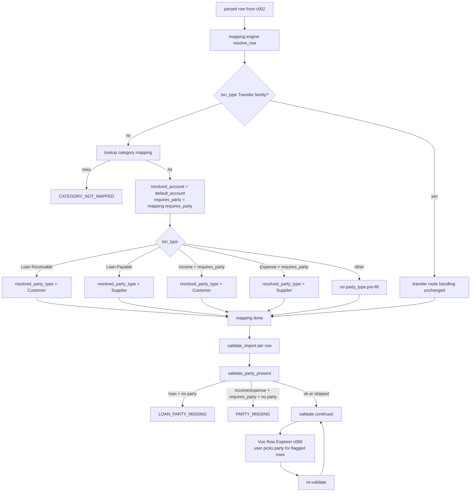

# Spec: c003 — mapping-engine-simplification

Story: [c003-story.md](./c003-story.md)
Architecture: f006 Decision 2 (drop rule-based party). Builds on c001 schema + c002 routing.

## Overview

Strip auto-party resolution from `importer/mapping.py`. Engine resolves account only; party is the user's job in c006 Vue Row Explorer. Add per-row party-required validation (`validate_party_present`) at validate_import time. Pre-fill `resolved_party_type` from `txn_type` (the only derivable party-side invariant) so the Vue page only needs the user to pick the actual party master, not its type.

## Component Detail

```yaml
id: c003
name: mapping-engine-simplification
type: backend-module
depends_on: [c001, c002]
```

## TD Decisions

1. **Two distinct error codes** — `LOAN_PARTY_MISSING` (loans) + `PARTY_MISSING` (Income/Expense). Existing PARTY_MISSING stays untouched. Distinct codes let c006 Vue map them to appropriately scoped party-picker modals (loan: pre-filtered Customer/Supplier per side; non-loan: same shape but lighter wording).
2. **Engine pre-fills `resolved_party_type`** based on `txn_type`:
   - Loan Receivable → Customer
   - Loan Payable → Supplier
   - Income + requires_party → Customer
   - Expense + requires_party → Supplier
   This is a derivable invariant from Decision 1 + existing requires_party semantics — not "guessing party". User only picks the party itself in Vue page. Saves one click per row, reduces error surface.
3. **`party_source` deprecated, not deleted.** Field stays on Cashew Import Row JSON for f004 revert backward compat with old runs. Engine writes `None`. New runs always show null. No migration of old values.
4. **Validation lives in `validation.py`.** `validate_party_present(row, requires_party_flag)` — single helper, called per row from validate_import after mapping engine has run.
5. **Helper signatures consume `set_row_validation_error` from c005.** Single error-write entry point, prefix lands automatically.
6. **`requires_party` flag on Cashew Category Mapping** keeps its existing semantic for Income/Expense. Loan rows ignore it (loan party requirement is hardcoded from Decision 1). No schema change to the flag.

## Function Spec

```python
# cashew_integration/importer/mapping.py — modifications

def resolve_row(row, acct_map, cat_map, run):
    """Existing entry. After c003:
    - Removes default_customer / default_supplier reads.
    - Removes party_source population.
    - Adds resolved_party_type pre-fill from txn_type.
    """
    # ... existing account-mapping resolution stays ...

    # Transfer / External Transfer / Adjustment: bypass category mapping (existing)
    if row["txn_type"] in ("Transfer", "External Transfer", "Adjustment"):
        # ... existing transfer-route handling ...
        return

    # Category resolution
    cat = cat_map.get((row["category"], row["sub_category"])) or cat_map.get((row["category"], ""))
    if cat is None:
        set_row_validation_error(row, "CATEGORY_NOT_MAPPED",
            f"No active Cashew Category Mapping for category '{row['category']}'.")
        return

    row["resolved_account"]   = cat["default_account"]
    row["requires_party"]     = cat.get("requires_party", 0)

    # Pre-fill party_type from txn_type (Decision 2 implication)
    txn_type = row["txn_type"]
    if txn_type == "Loan Receivable":
        row["resolved_party_type"] = "Customer"
    elif txn_type == "Loan Payable":
        row["resolved_party_type"] = "Supplier"
    elif txn_type == "Income" and row["requires_party"]:
        row["resolved_party_type"] = "Customer"
    elif txn_type == "Expense" and row["requires_party"]:
        row["resolved_party_type"] = "Supplier"
    # else: leave resolved_party_type null — no party expected

    # NOTE: resolved_party / party_source NOT set by engine. User fills in Vue.
    # NOTE: default_customer / default_supplier on run NOT consulted.


# cashew_integration/importer/validation.py — additive

def validate_party_present(row: dict) -> None:
    """Called from validate_import per row after mapping engine has run.
    Sets validation error if a party is required but not set.
    Skips Transfer-family and unmapped rows (other validation already handled).
    """
    txn_type = row.get("txn_type")
    if txn_type in ("Transfer", "External Transfer", "Adjustment"):
        return

    # Loan rows: hardcoded party requirement from Decision 1
    if txn_type in ("Loan Receivable", "Loan Payable"):
        if not row.get("resolved_party"):
            expected = "Customer" if txn_type == "Loan Receivable" else "Supplier"
            set_row_validation_error(row, "LOAN_PARTY_MISSING",
                f"{txn_type} row requires a {expected} party. Set party in Row Explorer.")
        return

    # Income / Expense: requires_party flag drives requirement
    if row.get("requires_party") and not row.get("resolved_party"):
        expected = "Customer" if txn_type == "Income" else "Supplier"
        set_row_validation_error(row, "PARTY_MISSING",
            f"This {txn_type} category requires a {expected} party. Set party in Row Explorer.")
```

## Files Affected

| file | change |
|---|---|
| `cashew_integration/importer/mapping.py` | Remove `default_customer` / `default_supplier` reads. Remove `party_source` writes. Remove auto-party resolution block. Add `resolved_party_type` pre-fill block. |
| `cashew_integration/importer/validation.py` | Add `validate_party_present`. Call from validate_import per-row pass after mapping engine. |
| existing tests in `cashew_integration/tests/test_mapping.py` | Update — drop assertions on `party_source`, `resolved_party` from run-default fallback paths. Add cases for `LOAN_PARTY_MISSING` + `resolved_party_type` pre-fill. |
| existing tests in `cashew_integration/tests/test_integration.py` | Same update — Loan-row integration tests must set party manually before queue_run, not rely on run defaults. |

## Data Flow



## Permissions

No change.

## Frappe Hooks

None.

## Notes / Gotchas

- **`resolved_party` is the user-set field.** Engine never writes to it. c006 Vue page mutates it per row. f004 revert reads it from posted-row snapshots — backward compat preserved.
- **`party_source` is deprecated but not deleted** (f004 backward compat).
- **Pre-filled `resolved_party_type` on a row whose `requires_party` is later turned off** — predicate is "writes only when expected"; if a category later changes from requires_party=1 to 0, old rows keep their pre-filled party_type. Cosmetic only. c002 option-b re-validation will re-run mapping engine on each validate, so live Cashew Settings edits flow through.
- **Loan rows always get `resolved_party_type` pre-filled** regardless of `requires_party` flag — loan party requirement is hardcoded from Decision 1, not flag-driven. Loan rows ignore `requires_party`.
- **No new schema fields.** Field deltas land in c001. c003 only changes engine logic.
- **No migration.** Existing posted runs keep their `party_source` values; no rewrite. New runs leave the column null.
- **Tests:** the existing test suite likely covers run-default fallback. Those test cases now need to either (a) set party manually before validate_import to assert success, or (b) assert the new `LOAN_PARTY_MISSING` / `PARTY_MISSING` error fires when party is unset. Bulk-grep test files for `default_customer`, `default_supplier`, `party_source`, `resolved_party` and adjust.

## Testing Notes (Dev Hand-off)

- Unit test `validate_party_present`: 8-case matrix —
  - Loan Receivable + party set → no error
  - Loan Receivable + party unset → LOAN_PARTY_MISSING
  - Loan Payable + party set → no error
  - Loan Payable + party unset → LOAN_PARTY_MISSING
  - Income + requires_party=1 + party set → no error
  - Income + requires_party=1 + party unset → PARTY_MISSING
  - Income + requires_party=0 → no error regardless of party
  - Transfer / External Transfer / Adjustment → no check fires
- Integration: import the user's `cashew-2026-05-03-06-31-00-370944.csv` with `Lent → Loan Out` mapping configured.
  - Without setting party: validate_import flags the Lent row with LOAN_PARTY_MISSING; remaining rows valid.
  - Set party=Customer "X" via mock Vue API call; re-validate → row clean.
  - queue_run posts Loan Receivable JE with party on receivable line (verified in c004 spec/tests).
- Regression: existing test_parser, test_mapping (account resolution paths), test_integration (Transfer/External Transfer/Adjustment paths) must still pass. Income/Expense + requires_party=0 rows must still post without party (existing behavior unchanged).

status: approved
