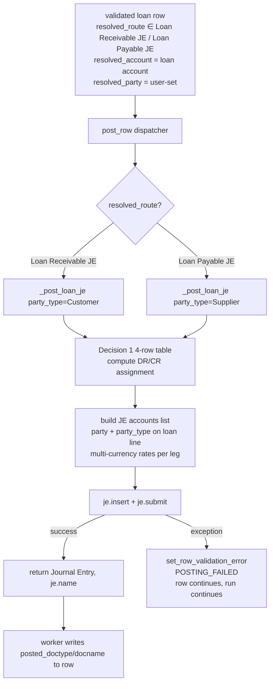

# Spec: c004 — posting-loan-handler

Story: [c004-story.md](./c004-story.md)
Architecture: f006 Decisions 1, 4. Builds on c001 schema + c002 routing + c003 mapping.

## Overview

Two new posting handlers in `importer/posting.py` — `_post_loan_receivable_je` and `_post_loan_payable_je` — wired into the existing `post_row` dispatcher by `resolved_route`. Mirrors the structure of `_post_journal_entry` (Income/Expense JE), with two deltas:

1. The category-side leg lands on a party-tracked Receivable/Payable account, with `party_type` + `party` on that GL line.
2. Debit/credit assignment is governed by `(txn_type, income_flag)` per Decision 1's 4-route table — not by `income_flag` alone.

Multi-currency, base_amount construction, JE rounding, and traceability fields all reuse existing helpers (`_get_account_currency`, exchange-rate handling, `cheque_no` / `user_remark` shape).

## Component Detail

```yaml
id: c004
name: posting-loan-handler
type: backend-module
depends_on: [c001, c002]
```

## TD Decisions

1. **Two handlers, one shared core.** `_post_loan_receivable_je` and `_post_loan_payable_je` differ only in `party_type` (Customer vs Supplier) and account currency lookup target. Share a `_post_loan_je(row, run, party_type)` core to dedupe.
2. **Debit/credit derived from `(txn_type, income_flag)`** explicitly via Decision 1 table. No reuse of existing `income_flag → bank_dr/bank_cr` block — that block assumes Income/Expense semantics (cash side mirrors income_flag direction). Loan rows have the same cash-side relationship to income_flag, but `cat_dr` / `cat_cr` (loan side) flips with income_flag in opposite direction from Income/Expense. Cleanest to compute fresh in the loan handler.
3. **Party on the loan-account line only.** ERPNext requires party on Receivable/Payable account GL entries. Cash-side line has no party. Match existing JE `accounts` dict shape — add `party_type` and `party` keys only on the loan-account dict.
4. **Account-currency lookup** for the loan account uses existing `_get_account_currency(loan_account, run.company)` — same helper used by Income/Expense path. Loan accounts are typically company-currency (PKR), so the exchange_rate path with `account_currency` + `debit/credit_in_account_currency` keeps the JE balanced in company currency.
5. **JE naming + traceability** match existing routes. `cheque_no` = `f"{run.name}#{row['row_idx']}"`, `user_remark` includes category, party, raw_amount, and source CSV note (truncated). One uniform tracing convention across all routes.
6. **Posting date** = `row["txn_date"]` (existing convention).
7. **Failure handling** — wrap JE construction in try/except; on failure call `set_row_validation_error(row, "POSTING_FAILED", str(exc))` (c005 helper) and return `(None, None)`. Worker's existing per-row error path continues without aborting the run.
8. **No new Frappe doctype.** Posting writes to ERPNext's stock `Journal Entry` doctype. Loan accounts are pre-existing chart accounts (per c008 guard).

## Function Spec

```python
# cashew_integration/importer/posting.py — additions

def post_row(row, run):
    """Existing dispatcher. Add two branches."""
    route = row.get("resolved_route")
    if route == "Journal Entry":
        return _post_journal_entry(row, run)
    if route == "Transfer JV":
        return _post_transfer_pair(...)
    if route == "External Transfer JE":
        return _post_external_transfer_je(row, run)
    if route == "Adjustment JE":
        return _post_adjustment_je(row, run)
    # NEW
    if route == "Loan Receivable JE":
        return _post_loan_je(row, run, party_type="Customer")
    if route == "Loan Payable JE":
        return _post_loan_je(row, run, party_type="Supplier")
    # ... SI / PI branches if separate ...
    raise ValueError(f"Unknown resolved_route: {route!r}")


def _post_loan_je(row, run, party_type: str):
    """Posts a single JE for a loan row.

    party_type: "Customer" for Loan Receivable, "Supplier" for Loan Payable.
    """
    from frappe.utils import flt

    cmp_cur = frappe.get_cached_value("Company", run.company, "default_currency")
    src_cur = row["source_currency"]                 # row currency (e.g. USD)
    exr     = flt(row["exchange_rate"] or 1)         # row → company FX
    base_amt = flt(row["base_amount"] or 0)          # company-currency total

    # Loan account currency (typically company currency)
    loan_account = row["resolved_account"]           # Loan Receivable or Loan Payable
    loan_cur = _get_account_currency(loan_account, run.company)
    loan_exr = 1.0 if loan_cur == cmp_cur else exr
    loan_amt = base_amt if loan_cur == cmp_cur else flt(row["raw_amount"])

    # Cash account = resolved_erp_account (Cashew Account Mapping result)
    cash_account = row["resolved_erp_account"]

    # Decision 1 routing table — debit/credit assignment
    txn_type   = row["txn_type"]      # "Loan Receivable" or "Loan Payable"
    income     = row["income_flag"] == "true"
    raw_amt    = abs(flt(row["raw_amount"]))         # always positive on JE legs

    # cash_dr = cash debited (money in); cash_cr = cash credited (money out)
    if txn_type == "Loan Receivable":
        # Loan Out: lent (income=false → cash out, loan up = DR loan)
        # Loan Out: repayment received (income=true → cash in, loan down = CR loan)
        if income:
            cash_dr, cash_cr = raw_amt, 0     # cash up
            loan_dr, loan_cr = 0, loan_amt    # loan down (DR cash / CR loan)
        else:
            cash_dr, cash_cr = 0, raw_amt     # cash down
            loan_dr, loan_cr = loan_amt, 0    # loan up (DR loan / CR cash)
    else:  # Loan Payable
        # Loan In: borrowed (income=true → cash in, loan up = CR loan)
        # Loan In: paid back (income=false → cash out, loan down = DR loan)
        if income:
            cash_dr, cash_cr = raw_amt, 0     # cash up
            loan_dr, loan_cr = 0, loan_amt    # loan up (CR loan)
        else:
            cash_dr, cash_cr = 0, raw_amt     # cash down
            loan_dr, loan_cr = loan_amt, 0    # loan down (DR loan)

    party = row.get("resolved_party")
    if not party:
        # validate_party_present (c003) should have caught this; defensive guard.
        raise frappe.ValidationError(
            f"{txn_type} row requires {party_type} party — none set."
        )

    cheque_no = f"{run.name}#{row['row_idx']}"
    user_remark = (
        f"Cashew loan import — {row['category']} | "
        f"{party_type}: {party} | {row['raw_account']} {row['raw_amount']} {src_cur}"
    )
    if row.get("note"):
        user_remark += f" | note: {row['note'][:200]}"

    je = frappe.get_doc({
        "doctype":        "Journal Entry",
        "voucher_type":   "Journal Entry",
        "company":        run.company,
        "posting_date":   row["txn_date"],
        "cheque_no":      cheque_no,
        "cheque_date":    row["txn_date"],
        "user_remark":    user_remark,
        "multi_currency": 1 if src_cur != cmp_cur or loan_cur != cmp_cur else 0,
        "accounts": [
            {
                "account":                    loan_account,
                "party_type":                 party_type,
                "party":                      party,
                "debit_in_account_currency":  loan_dr,
                "credit_in_account_currency": loan_cr,
                "exchange_rate":              loan_exr,
                "account_currency":           loan_cur,
            },
            {
                "account":                    cash_account,
                "debit_in_account_currency":  cash_dr,
                "credit_in_account_currency": cash_cr,
                "exchange_rate":              exr,
                "account_currency":           src_cur,
            },
        ],
    })
    je.insert()
    je.submit()
    return "Journal Entry", je.name
```

## Decision 1 Routing Table — Verification Matrix

| `txn_type` | `income_flag` | DR | CR | party on |
|---|---|---|---|---|
| Loan Receivable | false (lent) | Loan Receivable | Cash | Loan Receivable line |
| Loan Receivable | true (repaid to me) | Cash | Loan Receivable | Loan Receivable line |
| Loan Payable | true (borrowed) | Cash | Loan Payable | Loan Payable line |
| Loan Payable | false (I paid back) | Loan Payable | Cash | Loan Payable line |

## Files Affected

| file | change |
|---|---|
| `cashew_integration/importer/posting.py` | Add `_post_loan_je` core + two route branches in `post_row` dispatcher. Reuse existing `_get_account_currency`. |
| `cashew_integration/importer/worker.py` | No code change — worker already calls `post_row` and writes back `posted_doctype` / `posted_docname` from its return. The new routes flow through automatically. |

## Data Flow



## Permissions

No change. Posting runs in the queued job's user context (per existing worker pattern).

## Frappe Hooks

None.

## f004 Revert Compatibility

Loan Receivable JE / Loan Payable JE post as standard ERPNext `Journal Entry` documents. f004's revert worker iterates rows where `posted_doctype="Journal Entry"` and `posted_docname` is set; calls `doc.cancel()`. ERPNext's stock JE cancel path:
- Flips `docstatus` to 2.
- Reverses GL entries (including the party-tracked receivable/payable lines).
- Updates Accounts Receivable/Payable Summary reports for the party.

No f004 code change needed. Verified mentally against f004 spec; integration test required (see below).

## Notes / Gotchas

- **`raw_amount` is signed in the CSV** (`-360.7` for outflow). Loan handler uses `abs()` and routes the sign through the DR/CR assignment logic. Cash account always uses `abs(raw_amount)` on either DR or CR.
- **`base_amount` was set during validate_import** by the existing `apply_exchange_rates` step (f001). Loan handler doesn't recompute — relies on validation having populated it for FX rows.
- **Loan account currency assumption:** typical setup is company-currency (PKR). If a user creates a USD-denominated Loan Receivable account, the multi-currency path activates same as for foreign-currency Income/Expense accounts. ERPNext handles `multi_currency=1` JEs correctly.
- **Party on cash-side line: never.** ERPNext's account picker filters party to Receivable/Payable accounts. Setting party on a Cash account would raise. Guard implicitly via the JE shape (only loan line has party keys).
- **Defensive party check** in handler complements c003's `validate_party_present`. validate_import should have caught missing party — this guard prevents a NULL party from reaching ERPNext if c003 was bypassed (e.g. someone calls `post_row` directly in a test or one-off script).
- **c005 prefix on POSTING_FAILED.** Failures route through `set_row_validation_error` — message lands prefixed `[Row N] ` in `validation_error_message`.
- **`multi_currency` flag** on the JE: 1 if either leg is non-company-currency, else 0. Single-currency loan rows (PKR loan + PKR cash) post as standard JEs without FX gymnastics.
- **No new error codes beyond `POSTING_FAILED`** (which is generic and may already exist).
- **Idempotency:** existing idempotency guard (f001 + f003) is `posted_doctype` + `posted_docname` based, agnostic to route. Re-running a completed loan row is a no-op (skipped).

## Testing Notes (Dev Hand-off)

- Unit test the 4-row Decision 1 matrix → assert DR/CR assignments + party_type per case.
- Integration test against `cashew-2026-05-03-06-31-00-370944.csv` row `category="Lent"` (USD -360.70) with:
  1. Cashew Category Mapping `Lent → Loan Out → default_account="Loan Receivable - <Co>"`.
  2. Cashew Account Mapping `NSave → "<Co> NSave USD account"`.
  3. Manual party set after validate: `resolved_party_type="Customer"`, `resolved_party="<test customer>"`.
  4. queue_run → assert one JE created with:
     - DR Loan Receivable - <Co>  PKR <base_amt>  party=test customer  (or USD <360.70> with multi_currency=1 if loan account is USD)
     - CR <Co> NSave USD account  USD 360.70
     - Both lines balance in company currency.
- f004 revert integration: run import → verify JE created → call revert API → assert JE docstatus=2, party report reflects reversal, row revert_status=Reverted.
- Multi-currency edge: USD row, PKR loan account → assert exchange_rate populated correctly on each leg, base totals balance.
- Per-row failure: corrupt resolved_account (point to a nonexistent account) → assert row gets POSTING_FAILED with `[Row N]` prefix, run completes other rows.

status: approved
