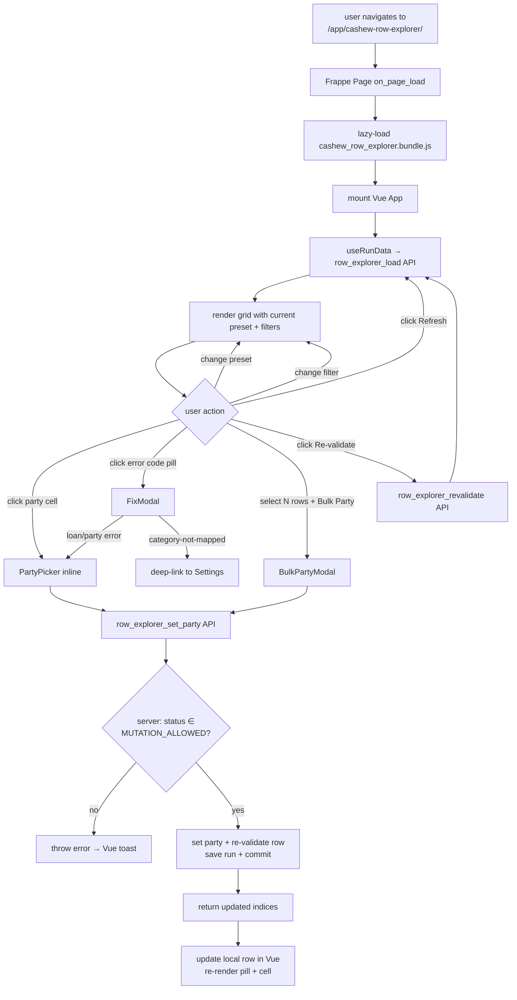

# Spec: c006 — vue-row-explorer-page

Story: [c006-story.md](./c006-story.md)
Architecture: f006 Decision 3 (Frappe Page + Vue 3, not Script Report). Builds on c001 schema, c003 mapping engine, c005 error prefix.

## Overview

A Frappe Page registered as `cashew-row-explorer`. Page controller mounts a Vue 3 SFC application that drives the entire UI. Reads + mutates Cashew Import Run rows through three whitelisted API methods. Five column presets, filter bar, status pills, inline party edit, fix-action modal driven by `validation_error_code`, bulk party set on filter selection.

## Component Detail

```yaml
id: c006
name: vue-row-explorer-page
type: frontend-page
depends_on: [c001, c003, c005]
```

## TD Decisions

1. **Frappe Page, not Frappe Form / Workspace.** Per Decision 3 — Pages mount custom JS without DocType form constraints. Vue 3 mounts inside the page's `wrapper` element.
2. **Vue 3 + Composition API.** No Pinia / external store — local refs + provide/inject is enough for this scope. Single SFC per concern (page shell, filter bar, grid, fix modal, bulk modal).
3. **Build pipeline:** standard Frappe `esbuild` — entry `cashew_integration/public/js/cashew_row_explorer/index.js` → bundle output `cashew_row_explorer.bundle.js`. Bundle declared in `app_include_js` in `hooks.py` OR loaded per-page in the page controller (page controller is preferred — keeps bundle out of every Desk page).
4. **Three API endpoints, all whitelisted, all permission-checked.** No DB ORM access from the frontend; all writes go through the API. API uses existing `cashew_integration/api.py`.
5. **Mutation gated by run status.** API rejects party-set / re-validate calls when run status ∈ `{Queued, Processing, Completed, Reverting, Reverted}`. Allowed in `{Draft, Validated, Failed, Cancelled, Revert-Failed}`.
6. **Re-validation reuses c002 + c003 helpers.** `row_explorer_revalidate` calls the same `_assign_txn_type` (c002) + `validate_party_present` + `check_category_account_class` (c001/c003) used by `validate_import`. Single source of truth for row state.
7. **Permissions** — frontend role check via `frappe.user.has_role`; backend permission check via `frappe.has_permission("Cashew Import Run", ptype="write", doc=run_name)` on every mutation.
8. **Pagination** — virtualized scroll for runs > 200 rows. Use a lightweight virtual-scroll lib (e.g. `vue-virtual-scroller`) or roll naive windowing. Backend `row_explorer_load` returns all rows in one call (typical run sizes <2k); pagination is pure-frontend rendering optimization.
9. **No real-time updates.** User explicitly clicks "Refresh" or triggers via mutate-then-refresh path. No websocket / Frappe realtime for v1.
10. **Loan-details surface (Option A)** — Loans-and-Parties preset shows `title`, `sub_category`, `note` columns for loan/party rows. No new schema fields.

## File Layout

```
cashew_integration/cashew_integration/page/cashew_row_explorer/
    __init__.py
    cashew_row_explorer.json     # Page doctype JSON
    cashew_row_explorer.js       # Page controller — mounts Vue app

cashew_integration/public/js/cashew_row_explorer/
    index.js                     # esbuild entry — imports App.vue, mounts to wrapper
    App.vue                      # root SFC — page shell + toolbar + grid
    components/
        FilterBar.vue
        ColumnPresetToggle.vue
        RowGrid.vue              # virtualized grid; renders by current preset
        StatusPill.vue
        PartyPicker.vue          # Frappe Link control wrapper
        FixModal.vue             # error-code-driven dispatcher
        BulkPartyModal.vue
        LoanDetailsRow.vue       # expanded sub-row for loan rows in Loans-and-Parties preset
    composables/
        useRunData.js            # load + cache run rows, expose refresh()
        useFilters.js            # filter state + computed filtered rows
        usePresets.js            # preset definitions + active preset state

cashew_integration/api.py        # add row_explorer_* whitelisted methods
```

## Page Controller (`cashew_row_explorer.js`)

```js
frappe.pages['cashew-row-explorer'].on_page_load = function(wrapper) {
    const run_name = frappe.get_route()[2];
    if (!run_name) {
        frappe.msgprint(__("No run name in URL — open from Cashew Import Run."));
        return;
    }

    const page = frappe.ui.make_app_page({
        parent: wrapper,
        title: __("Cashew Row Explorer — {0}", [run_name]),
        single_column: true,
    });

    // Lazy-load the Vue bundle so it's not in every Desk page.
    frappe.require(
        "/assets/cashew_integration/js/cashew_row_explorer.bundle.js",
        () => {
            // The bundle's entry registers a global mounter:
            //   window.cashew_mount_row_explorer(el, props)
            const mountEl = page.body.get(0);
            window.cashew_mount_row_explorer(mountEl, { run_name });
        }
    );
};
```

## Vue Bundle Entry (`public/js/cashew_row_explorer/index.js`)

```js
import { createApp } from "vue";
import App from "./App.vue";

window.cashew_mount_row_explorer = (el, props) => {
    const app = createApp(App, props);
    app.mount(el);
};
```

## Backend API (`cashew_integration/api.py`)

```python
import frappe
from frappe import _
from typing import Optional
from cashew_integration.importer.validation import (
    check_category_account_class,
    validate_party_present,
    set_row_validation_error,
)
from cashew_integration.importer.parser import _assign_txn_type
from cashew_integration.importer.category_lookup import build_category_type_map


_MUTATION_ALLOWED_STATUSES = {
    "Draft", "Validated", "Failed", "Cancelled", "Revert-Failed",
}


@frappe.whitelist()
def row_explorer_load(run_name: str) -> dict:
    """Read-only. Returns rows + run-level counts + enum hints for the UI."""
    run = frappe.get_doc("Cashew Import Run", run_name)
    frappe.has_permission("Cashew Import Run", ptype="read",
                          doc=run, throw=True)

    rows = [
        {
            # all fields the UI presets reference — no fetch_all
            "row_idx": r.row_idx,
            "txn_date": r.txn_date,
            "raw_amount": r.raw_amount,
            "source_currency": r.source_currency,
            "company_currency": r.company_currency,
            "exchange_rate": r.exchange_rate,
            "base_amount": r.base_amount,
            "income_flag": r.income_flag,
            "txn_type": r.txn_type,
            "category": r.category,
            "sub_category": r.sub_category,
            "title": r.title,
            "note": r.note,
            "raw_account": r.raw_account,
            "resolved_route": r.resolved_route,
            "requires_party": r.requires_party,
            "resolved_account": r.resolved_account,
            "resolved_erp_account": r.resolved_erp_account,
            "resolved_external_account": r.resolved_external_account,
            "resolved_party_type": r.resolved_party_type,
            "resolved_party": r.resolved_party,
            "validation_status": r.validation_status,
            "validation_error_code": r.validation_error_code,
            "validation_error_message": r.validation_error_message,
            "posted_doctype": r.posted_doctype,
            "posted_docname": r.posted_docname,
            "posted_gl_date": r.posted_gl_date,
            "is_duplicate": r.is_duplicate,
            "revert_status": r.revert_status,
            "revert_error": r.revert_error,
        }
        for r in run.import_rows
    ]

    return {
        "run_name": run.name,
        "status": run.status,
        "company": run.company,
        "rows_total": run.rows_total,
        "rows_valid": run.rows_valid,
        "rows_posted": run.rows_posted,
        "rows_failed": run.rows_failed,
        "rows_skipped": run.rows_skipped,
        "mutation_allowed": run.status in _MUTATION_ALLOWED_STATUSES,
        "rows": rows,
        "enums": {
            "txn_type":  ["Income", "Expense", "Transfer", "External Transfer",
                          "Adjustment", "Loan Receivable", "Loan Payable"],
            "validation_status": ["", "Valid", "Error", "Skipped"],
        },
    }


@frappe.whitelist()
def row_explorer_set_party(
    run_name: str,
    row_indices: list[int],
    party_type: str,
    party: str,
) -> dict:
    """Set party_type + party on selected rows. Re-validates affected rows."""
    run = frappe.get_doc("Cashew Import Run", run_name)
    frappe.has_permission("Cashew Import Run", ptype="write",
                          doc=run, throw=True)

    if run.status not in _MUTATION_ALLOWED_STATUSES:
        frappe.throw(_("Cannot edit rows when run status is {0}.").format(run.status))

    if party_type not in ("Customer", "Supplier"):
        frappe.throw(_("party_type must be Customer or Supplier."))

    # Validate party exists
    if not frappe.db.exists(party_type, party):
        frappe.throw(_("{0} '{1}' does not exist.").format(party_type, party))

    target_idxs = set(int(i) for i in row_indices)
    updated = []
    errors = []
    cat_map = build_category_type_map()

    for r in run.import_rows:
        if r.row_idx not in target_idxs:
            continue
        r.resolved_party_type = party_type
        r.resolved_party = party

        # Re-validate this row in-place
        row_dict = r.as_dict()
        # Re-apply c002 routing in case category_type changed
        _assign_txn_type(row_dict, cat_map)
        # Re-apply class predicate + party-required check
        msg = check_category_account_class(
            row_dict.get("category_type"), row_dict.get("resolved_account"),
        )
        # Clear stale error then re-run validate_party_present
        if r.validation_error_code in ("LOAN_PARTY_MISSING", "PARTY_MISSING") \
                and r.resolved_party:
            r.validation_status = "Valid"
            r.validation_error_code = None
            r.validation_error_message = None
        validate_party_present(row_dict)

        # Pull updated state back to child doc
        for k in ("txn_type", "resolved_route", "validation_status",
                  "validation_error_code", "validation_error_message"):
            if k in row_dict:
                setattr(r, k, row_dict[k])

        updated.append(r.row_idx)

    run.save(ignore_permissions=False)
    frappe.db.commit()

    return {"updated": updated, "errors": errors}


@frappe.whitelist()
def row_explorer_revalidate(
    run_name: str,
    row_indices: Optional[list[int]] = None,
) -> dict:
    """Re-run c002 + c003 validation against current Cashew Settings.
    If row_indices is None, re-validates all non-Skipped, non-Posted rows.
    """
    run = frappe.get_doc("Cashew Import Run", run_name)
    frappe.has_permission("Cashew Import Run", ptype="write",
                          doc=run, throw=True)

    if run.status not in _MUTATION_ALLOWED_STATUSES:
        frappe.throw(_("Cannot revalidate when run status is {0}.").format(run.status))

    cat_map = build_category_type_map()
    target = (
        set(int(i) for i in row_indices) if row_indices is not None else None
    )

    revalidated = 0
    for r in run.import_rows:
        if target is not None and r.row_idx not in target:
            continue
        if r.posted_docname or r.validation_status == "Skipped":
            continue

        row_dict = r.as_dict()
        # Clear prior errors
        row_dict["validation_status"] = ""
        row_dict["validation_error_code"] = None
        row_dict["validation_error_message"] = None
        # Re-route + re-validate
        _assign_txn_type(row_dict, cat_map)
        validate_party_present(row_dict)
        # Pull state back
        for k in ("txn_type", "resolved_route", "validation_status",
                  "validation_error_code", "validation_error_message"):
            setattr(r, k, row_dict.get(k))
        revalidated += 1

    run.save(ignore_permissions=False)
    frappe.db.commit()
    return {"revalidated": revalidated}
```

## Vue Component Contracts

### `App.vue` (root)
- Props: `run_name`.
- State (refs): `runData`, `activePreset`, `filters`, `selectedRowIdxs`, `loading`.
- On mount: calls `useRunData(run_name)` → loads via `row_explorer_load`.
- Layout: `<FilterBar>`, `<ColumnPresetToggle>`, action buttons (Refresh, Bulk Party, Export-CSV), `<RowGrid>`.

### `RowGrid.vue`
- Props: `rows`, `preset`, `selectedIdxs`.
- Emits: `select-row(idx, multi)`, `edit-party(idx)`, `open-fix-modal(idx)`, `select-all-filtered()`.
- Renders columns from `usePresets()`'s active preset definition.
- Status column delegates to `<StatusPill>`.
- Loan rows in Loans-and-Parties preset render an expandable `<LoanDetailsRow>` showing title + sub_category + note + party.

### `FixModal.vue`
- Props: `row` (the row to fix), `errorCode`.
- Internal switch on `errorCode`:
  - `LOAN_PARTY_MISSING` / `PARTY_MISSING` → `<PartyPicker partyType="Customer|Supplier">` + Save button.
  - `CATEGORY_NOT_MAPPED` → message + button "Open Cashew Settings" (deep-link to `/app/cashew-settings#category_mappings`).
  - `CATEGORY_ACCOUNT_CLASS_MISMATCH` → message + button "Open Mapping" (deep-link to Cashew Settings, scroll to category).
  - `EXTERNAL_ACCOUNT_NOT_MAPPED` → message + "Open Account Mapping" deep-link.
  - default → plain message + "Acknowledge" button.
- On save:
  - Party-type fixes call `row_explorer_set_party(run_name, [row.row_idx], type, party)`.
  - Other fix types are read-only (user fixes upstream + clicks "Refresh" on parent).

### `BulkPartyModal.vue`
- Props: `runName`, `selectedRowIdxs`, `partyTypeHint` (derived from selection — must be uniform; reject mixed).
- Calls `row_explorer_set_party(run_name, idxs, party_type, party)`.

### `PartyPicker.vue`
- Wraps Frappe's stock `frappe.ui.form.make_control({fieldtype: "Link"})` so it gets autocomplete + create-on-the-fly.
- Props: `partyType`, `modelValue`. Emits `update:modelValue`.

### `StatusPill.vue`
- Props: `status` (raw `validation_status` or computed Posted/Reverted state).
- Renders span with class `pill pill-{green|red|gray|blue|amber}`.

## Files Affected

| file | change |
|---|---|
| `cashew_integration/cashew_integration/page/cashew_row_explorer/__init__.py` | NEW — empty. |
| `cashew_integration/cashew_integration/page/cashew_row_explorer/cashew_row_explorer.json` | NEW — Frappe Page doctype JSON. Module: `Cashew Integration`. Roles: Accountant, System Manager. |
| `cashew_integration/cashew_integration/page/cashew_row_explorer/cashew_row_explorer.js` | NEW — page controller, lazy-loads the Vue bundle. |
| `cashew_integration/public/js/cashew_row_explorer/...` | NEW — Vue 3 SFC tree (root App + components + composables). |
| `cashew_integration/api.py` | ADD `row_explorer_load`, `row_explorer_set_party`, `row_explorer_revalidate` whitelisted methods. |
| `cashew_integration/hooks.py` | If using app-wide bundle: add to `app_include_js`. Preferred: page-controller `frappe.require` (no hooks change). |
| `cashew_integration/build.json` (or app's bundling config) | Wire new entry `cashew_row_explorer/index.js` → `cashew_row_explorer.bundle.js`. Standard `bench build --app cashew_integration`. |

## Permissions

- **Page-level**: roles Accountant, System Manager (declared in `cashew_row_explorer.json`).
- **API-level**: `frappe.has_permission("Cashew Import Run", ptype="read"/"write", doc=run, throw=True)` on every entry.
- **Mutation guard**: API checks `run.status in _MUTATION_ALLOWED_STATUSES` before any write.
- **Party existence**: API checks party exists before assigning (rejects typos).

## Frappe Hooks

- Optional `app_include_js` if bundle isn't lazy-loaded by the page controller. Preferred path is page-controller-load (no hook).

## Data Flow



## Notes / Gotchas

- **Bundle size + lazy load** — `frappe.require` in the page controller keeps Vue out of every Desk page. Bundle target ≈ <500 KB gzipped (Vue 3 + small lib set). Verify after first build.
- **Run.import_rows is a child table** — fully loaded on `frappe.get_doc("Cashew Import Run", run_name)`. For runs with thousands of rows, consider switching to direct child-table query (`frappe.get_all("Cashew Import Row", filters={"parent": run_name}, fields=[...])`) if `get_doc` becomes slow. Defer optimization until measured.
- **`run.save()` on every party set** is acceptable for v1 — typical bulk size is <200 rows; child-table save is ~ms. If perf becomes an issue, switch to `frappe.db.set_value` per-row + skip parent save (loses parent timestamp update — accept).
- **Re-validation idempotency** — `_assign_txn_type` and `validate_party_present` are pure functions on the row dict; safe to call repeatedly. c005's double-prefix guard handles re-validated error messages.
- **Row data freshness after mutate** — `row_explorer_set_party` returns the updated indices; Vue patches the local rows from the response payload. No full reload.
- **Modal vs inline edit** — both routes hit the same API. Inline cell edit is faster for one-off fixes; modal is the recovery path when the user clicks a status pill on an error row.
- **Posted rows are read-only.** Grid greys out party cell when `posted_docname` is set; modal opens in read-only mode if invoked on a posted row.
- **Reverted rows are read-only.** Same as posted — `revert_status='Reverted'` blocks party edit (would mismatch the cancelled JE; revert path doesn't re-post).
- **Frappe v15 vs v16 Vue support** — confirm during dev pass whether Frappe-side helpers (`frappe.ui.form.make_control` for the party Link picker) work cleanly inside a Vue component or need a small wrapper. Either is acceptable.
- **No DocType-form dependency.** Page is fully decoupled from Cashew Import Run form; user can keep both open in separate tabs.
- **CSV export** — optional v1 nice-to-have. "Export current view" button serializes filtered rows into a CSV download. Backend not required (frontend-only). Skip if scope-creeping.
- **Accessibility** — keyboard nav on grid (j/k for row, enter to expand, e to edit party); ARIA labels on pills. Standard Frappe patterns.
- **i18n** — labels go through `__()` per Frappe convention.

## Testing Notes (Dev Hand-off)

- Smoke: visit `/app/cashew-row-explorer/<existing-run>` after bench restart → page loads, grid renders rows.
- Preset toggle: switch all five presets → columns change without page reload.
- Inline party edit: click `resolved_party` cell on a Loan Receivable row → picker pre-filtered to Customer; pick + save → status pill flips Error → Valid; row.resolved_party persists across `Refresh`.
- Bulk party set: filter to all `LOAN_PARTY_MISSING` rows for a category, select all, set party → all rows update + re-validate.
- Mutation gate: open Row Explorer for a run with status=Processing; party cells are disabled, API rejects mutation calls (toast).
- Permissions: log in as a user without Cashew Import Run write → page loads (read-only), API mutation calls return 403.
- Re-validation flow: edit a Cashew Category Mapping (change category_type from Income → Loan Out), open Row Explorer for an existing parsed run, click Re-validate → affected rows flip txn_type + resolved_route accordingly.
- Loan-details surface: switch to Loans-and-Parties preset, expand a loan row → title + sub_category + note + party visible.
- Edge: 0-row run → page renders empty grid + helpful empty-state message.
- Edge: 2000-row run → virtualized scroll keeps frame rate above 30fps.

status: approved
