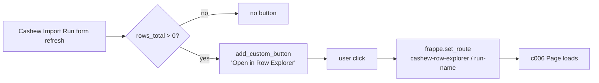

# Spec: c007 — import-run-form-slim

Story: [c007-story.md](./c007-story.md)
Architecture: f006 Decision 3 (Vue Row Explorer is canonical row-level surface, but form-grid kept per user direction 2026-05-03 — co-exists with the page).

## Overview

Smallest component in f006. Adds a single custom button to the Cashew Import Run form that deep-links to the Vue Row Explorer. Grid stays as-is. No field hiding beyond what c001 already did.

## Component Detail

```yaml
id: c007
name: import-run-form-slim
type: form-customization
depends_on: [c006]
```

## TD Decisions

1. **Button-only change.** No grid touch, no layout removal, no field hiding (revised from initial scope on user direction — table is still useful for in-form glance). Original "slim down the grid" framing dropped; component name kept for traceability.
2. **`add_custom_button` over modifying form layout JSON.** Pure JS controller addition. No `cashew_import_run.json` edit needed. Easier to maintain, doesn't fight Frappe's form-builder customizations.
3. **Button visibility gate:** show only when `frm.doc.rows_total > 0` (no point opening Row Explorer for an empty run). Use `frm.refresh_field` / re-evaluate on `refresh` event.
4. **Button placement:** primary action area, distinct from secondary actions like Validate / Queue. Use `frm.page.set_primary_action` only if the run is in an actionable state; otherwise `frm.add_custom_button` to keep it alongside other run actions. Defer the placement nuance to Dev — both shapes are acceptable.
5. **Open in same tab vs new tab:** open in same tab via `frappe.set_route` for normal Frappe navigation. Cmd/Ctrl-click still opens in new tab via standard browser behavior on the underlying `<a>`.

## Function Spec

```js
// cashew_integration/cashew_integration/doctype/cashew_import_run/cashew_import_run.js

frappe.ui.form.on("Cashew Import Run", {
    refresh(frm) {
        // Existing buttons (Validate Import, Queue Run, etc.) stay as-is.
        // Add the Row Explorer deep-link only when there are rows to explore.
        if (frm.doc.rows_total && frm.doc.rows_total > 0) {
            frm.add_custom_button(__("Open in Row Explorer"), () => {
                frappe.set_route("cashew-row-explorer", frm.doc.name);
            }).addClass("btn-primary");
        }
    },
});
```

## Files Affected

| file | change |
|---|---|
| `cashew_integration/cashew_integration/doctype/cashew_import_run/cashew_import_run.js` | Add `refresh` event handler with `add_custom_button` for "Open in Row Explorer". |

If the file doesn't exist, create it with the standard Frappe form-event boilerplate. If existing, append the refresh handler (or extend an existing one).

## Permissions

No change. Button is visible to anyone who can read the Cashew Import Run; the Row Explorer page enforces its own role check (Accountant + System Manager).

## Frappe Hooks

None.

## Data Flow



## Notes / Gotchas

- **No grid removal, no field changes** — earlier f006 framing planned to slim the grid; user reverted. Grid stays.
- **`default_customer` / `default_supplier` hide is c001's** doing (`hidden:1` in JSON). c007 doesn't double-hide; layout is already correct.
- **Button on revert / cancelled runs** still useful — user opens Row Explorer to audit reverted state. Don't gate on status.
- **Button on Draft/empty runs** — guarded by `rows_total > 0` so it doesn't show before parse populates rows.
- **Existing run-level buttons unchanged** (Validate Import, Queue Run, Cancel Run, Revert Run, Repair). Doesn't conflict.
- **Mobile** — Frappe's standard custom buttons render in the form's action menu on narrow viewports; tappable.

## Testing Notes (Dev Hand-off)

- Open a run with `rows_total=0` → button not visible.
- Open a run with `rows_total>0` → button visible; click navigates to `/app/cashew-row-explorer/<run-name>`.
- All existing run-level actions remain functional and unchanged.
- Button visible regardless of run status (Draft/Validated/Queued/Processing/Completed/Failed/Cancelled/Reverting/Reverted/Revert-Failed) once `rows_total>0`.

status: approved
