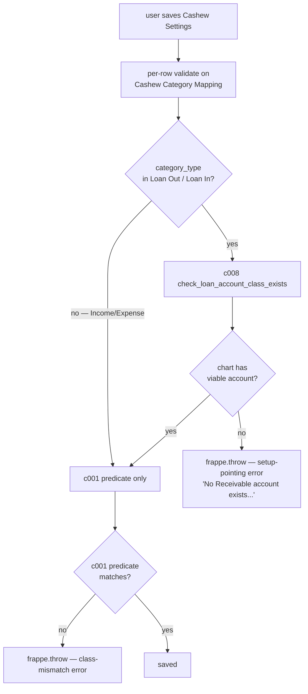

# Spec: c008 — loan-accounts-guard

Story: [c008-story.md](./c008-story.md)
Architecture: f006 Decision 4 (shared Loan Receivable / Loan Payable accounts with party tracking).

## Overview

Two-layer save-time validation on Cashew Category Mapping rows whose `category_type ∈ {Loan Out, Loan In}`:

1. **c008 — chart-of-accounts existence check** (this component): at least one viable account exists.
2. **c001 — predicate already in place**: the picked account matches the required class.

c008 runs first. Its error is more actionable when the chart isn't set up — it tells the user *where* to fix things (chart of accounts), not just *what* is wrong (this picked account).

## Component Detail

```yaml
id: c008
name: loan-accounts-guard
type: backend-module
depends_on: [c001]
```

## TD Decisions

1. **Helper lives in `validation.py`** alongside `check_category_account_class` (c001). Both helpers are loan-class predicates; co-locating keeps a single home for "what does a valid loan account look like".
2. **Scope: single-company assumption.** Per system-arch "Configuration Structure" decision, Cashew Settings has no `company` field on config rows. The chart-existence query runs unscoped (any company in the bench). Multi-company support is out of f006 scope.
3. **Filter: `disabled=0`.** A chart with only disabled Receivable accounts effectively has none; user must enable or create one. Matches Account picker UX in standard ERPNext.
4. **Order: c008 → c001.** If chart has no candidate, c008's "set up the chart" error is more useful than c001's "this picked account is wrong" (both would be true; c008's pointer is actionable).
5. **No action wired to a setup wizard URL** (Decision 4 mentions one but f005 setup wizard is separate). Error text references "Setup → Chart of Accounts" by name. If f005 ships a `/loan-account-setup` route later, c008 message can be edited then.

## Function Spec

```python
# cashew_integration/importer/validation.py — additive

import frappe
from typing import Optional

_LOAN_TYPE_REQUIREMENTS = {
    "Loan Out": {"root_type": "Asset",     "account_type": "Receivable"},
    "Loan In":  {"root_type": "Liability", "account_type": "Payable"},
}

def check_loan_account_class_exists(category_type: str) -> Optional[str]:
    """Returns None if at least one viable account exists for the loan
    category_type. Returns a friendly setup-pointing error message otherwise.

    Skips non-loan category_types (returns None unconditionally).
    """
    req = _LOAN_TYPE_REQUIREMENTS.get(category_type)
    if req is None:
        return None  # Income / Expense / unknown — c008 doesn't apply

    exists = frappe.db.exists("Account", {
        "root_type":    req["root_type"],
        "account_type": req["account_type"],
        "is_group":     0,
        "disabled":     0,
    })
    if exists:
        return None

    role = "Receivable" if category_type == "Loan Out" else "Payable"
    asset_or_liability = req["root_type"]
    sample = "Loan Receivable" if category_type == "Loan Out" else "Loan Payable"

    return (
        f"No {role} account exists in your chart of accounts. "
        f"Create or configure a {asset_or_liability} account with "
        f"account_type={role} (e.g. '{sample} - <Co>') before mapping a "
        f"{category_type} category. See: Setup → Chart of Accounts."
    )
```

## Files Affected

| file | change |
|---|---|
| `cashew_integration/importer/validation.py` | Add `_LOAN_TYPE_REQUIREMENTS` table + `check_loan_account_class_exists` helper. (c001's `check_category_account_class` can read from the same table to dedupe — minor refactor opportunity, optional.) |
| `cashew_integration/cashew_integration/doctype/cashew_category_mapping/cashew_category_mapping.py` | Extend `validate` method: call c008 check first, then c001 predicate. |

## Controller Update

```python
# cashew_category_mapping.py — extends c001's controller

import frappe
from frappe.model.document import Document
from cashew_integration.importer.validation import (
    check_category_account_class,
    check_loan_account_class_exists,
)


class CashewCategoryMapping(Document):
    def validate(self):
        # c008 first — actionable when chart isn't set up
        msg = check_loan_account_class_exists(self.category_type)
        if msg:
            frappe.throw(msg)

        # c001 — picked account matches the required class
        msg = check_category_account_class(self.category_type, self.default_account)
        if msg:
            frappe.throw(msg)
```

## Data Flow



## Permissions

No change. Validation runs in user context.

## Frappe Hooks

None. Doctype controller method auto-wires.

## Notes / Gotchas

- **Single-company assumption.** Multi-company benches with charts in only some companies will show false-positive "exists" — c008 won't catch a missing account in the company actually used by the eventual Cashew Import Run. Out of f006 scope; system-arch Configuration Structure decision pins Cashew to single-company.
- **`is_group=0` filter** is essential. ERPNext chart has parent group accounts (`is_group=1`) which inherit account_type from children but aren't themselves postable. Filtering them out matches what `default_account` Link picker shows.
- **`disabled=0` filter** matches standard ERPNext picker behavior — disabled accounts are hidden from selection.
- **No effect on already-saved mappings.** ERPNext only runs `validate` on save. Existing rows stay valid until edited. If chart is later torn down, existing mappings keep working until the next edit attempt.
- **Optional refactor:** c001's `check_category_account_class` and c008's `check_loan_account_class_exists` both encode "what's a valid loan account class" — they could share `_LOAN_TYPE_REQUIREMENTS`. Listed as a minor opportunity, not required for c008.
- **Error text doesn't hardcode account names.** "e.g. 'Loan Receivable - <Co>'" is illustrative; user's chart may use different naming conventions. Keeps the error company-name-agnostic.
- **No DB query when category_type is Income / Expense.** Helper short-circuits — no perf impact on the common path.

## Testing Notes (Dev Hand-off)

- Unit test `check_loan_account_class_exists`:
  - Loan Out + chart with one Receivable Asset → None.
  - Loan Out + chart with no Receivable Asset → returns error string referencing "Receivable" + "Asset".
  - Loan Out + chart with disabled Receivable Asset → returns error.
  - Loan Out + chart with only group Receivable Asset (`is_group=1`) → returns error.
  - Loan In + chart with one Payable Liability → None.
  - Income / Expense → None unconditionally (helper short-circuits).
- Integration test: save Cashew Category Mapping `Lent → Loan Out` with chart pre-cleared of Receivable accounts → expect ValidationError matching c008 error shape. Add a Receivable Asset account → save succeeds (assuming `default_account` also picked correctly per c001).

status: approved
