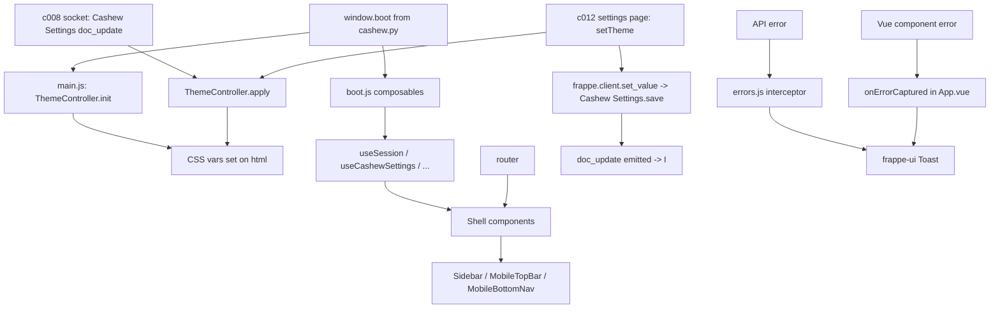

# c004 — spa-router-shell

> **Type:** ui-shell
> **Depends on:** c001 (scaffold), c002 (boot dict shape); benefits from
> c013 + Amendment 1 ready (so accent fields exist in boot)
> **Arch refs:** D2 (HTML5 history + responsive primitives), D5.c
> (shell-level 403 / error handling), D6 (state pattern, session-only),
> D9 (`/` is finance dashboard), D10 (run workspace routes), D12
> (`/settings` 4th route), D14 (theming pipeline), c013 Amendment 1
> (Custom accent escape hatch + HSL shade derivation)
> **Sharding:** This spec is one file. If line growth crosses ~350,
> continuation will land at `c004-spec-b.md`.

---

## Overview

The shell wraps every SPA page. Five routes; responsive layout that
swaps a desktop **sidebar** for a mobile **bottom-nav bar + slim top
bar**; ThemeController applies the user's accent (preset or Custom hex)
to four CSS vars on `<html>`; boot-adapter composables surface
`window.boot` to Vue land; state composables hold cross-component
session-only state (D6 binding); an error boundary + HTTP interceptor
funnel failures into frappe-ui Toasts (D5.c).

This component holds no page logic — that lives in c005, c006, c007,
c012. It also holds no realtime logic — c008 owns the socket connection,
calls into ThemeController on `Cashew Settings` doc_update events.

---

## Routes

Five named routes + a catch-all. HTML5 history; base path `/cashew`.

| Path | Name | Component (lazy) | meta.title | Component spec |
|---|---|---|---|---|
| `/` | `finance-dashboard` | `pages/FinanceDashboard.vue` | `"Dashboard"` | c007 |
| `/runs` | `imports-list` | `pages/ImportsList.vue` | `"Imports"` | c005 |
| `/runs/new` | `run-workspace-new` | `pages/RunWorkspace.vue` | `"New Import"` | c006 |
| `/runs/:run_name` | `run-workspace` | `pages/RunWorkspace.vue` | `"Import Run"` | c006 |
| `/settings` | `settings` | `pages/Settings.vue` | `"Settings"` | c012 |
| `/:catchAll(.*)` | — | redirect to `/` | — | — |

`/runs/new` and `/runs/:run_name` resolve to the same SFC (`RunWorkspace.vue`); the component reads `route.name` to distinguish "fresh" vs "load existing". On parse success the component does `router.replace('/runs/' + name)` (replace, not push — avoids back-button landing on stale empty state).

### `src/router.js`

```js
import { createRouter, createWebHistory } from 'vue-router';

export const routes = [
  {
    path: '/',
    name: 'finance-dashboard',
    component: () => import('@/pages/FinanceDashboard.vue'),
    meta: { title: 'Dashboard' },
  },
  {
    path: '/runs',
    name: 'imports-list',
    component: () => import('@/pages/ImportsList.vue'),
    meta: { title: 'Imports' },
  },
  {
    path: '/runs/new',
    name: 'run-workspace-new',
    component: () => import('@/pages/RunWorkspace.vue'),
    meta: { title: 'New Import' },
  },
  {
    path: '/runs/:run_name',
    name: 'run-workspace',
    component: () => import('@/pages/RunWorkspace.vue'),
    meta: { title: 'Import Run' },
    props: true,
  },
  {
    path: '/settings',
    name: 'settings',
    component: () => import('@/pages/Settings.vue'),
    meta: { title: 'Settings' },
  },
  {
    path: '/:catchAll(.*)',
    redirect: '/',
  },
];

export function createCashewRouter() {
  return createRouter({
    history: createWebHistory('/cashew'),
    routes,
    // S3: preserve scroll on back/forward; top on push
    scrollBehavior(to, from, savedPosition) {
      if (savedPosition) return savedPosition;
      return { top: 0 };
    },
  });
}
```

Document title update via `afterEach` guard (in `main.js`):
```js
router.afterEach((to) => {
  document.title = `${to.meta.title || 'Cashew'} · Cashew`;
});
```

---

## `src/main.js`

```js
import { createApp } from 'vue';
import { FrappeUI } from 'frappe-ui';
import App from './App.vue';
import { createCashewRouter } from './router';
import { ThemeController } from './theme';
import { installErrorInterceptors } from './errors';
import './index.css';

// 1. Apply theme BEFORE mount — prevents flash of wrong color.
ThemeController.init();

const router = createCashewRouter();
router.afterEach((to) => {
  document.title = `${to.meta?.title || 'Cashew'} · Cashew`;
});

const app = createApp(App);
app.use(router);
app.use(FrappeUI);

// 2. HTTP interceptor for 401/403/5xx/network → Toast (D5.c).
installErrorInterceptors();

app.mount('#app');
```

`FrappeUI` plugin registers frappe-ui components globally + initializes the CSRF token from `window.boot.csrf_token`. If the installed frappe-ui plugin doesn't auto-pick the CSRF token, Dev sets it explicitly (see Open items).

---

## `src/App.vue`

Layout (CSS via Tailwind utility classes; component is intentionally lean):

```vue
<script setup>
import { onErrorCaptured } from 'vue';
import { createToast } from 'frappe-ui';
import Sidebar from '@/components/Shell/Sidebar.vue';
import MobileTopBar from '@/components/Shell/MobileTopBar.vue';
import MobileBottomNav from '@/components/Shell/MobileBottomNav.vue';

// Shell-level Vue error boundary (D5.c).
// Returning false here lets dev tools still see the error.
onErrorCaptured((err, instance, info) => {
  console.error('[cashew] component error:', err, info, instance);
  createToast({
    title: 'Something broke on this page',
    text: err?.message || String(err),
    icon: 'alert-triangle',
    iconClasses: 'text-red-600',
  });
  return false;
});
</script>

<template>
  <div class="cashew-app min-h-screen flex bg-gray-50 text-gray-900">
    <!-- Desktop sidebar (md+) -->
    <Sidebar class="hidden md:flex" />

    <div class="flex-1 flex flex-col min-w-0">
      <!-- Mobile top bar (<md) -->
      <MobileTopBar class="md:hidden" />

      <!-- Page content -->
      <main class="cashew-main flex-1 min-w-0 overflow-y-auto">
        <RouterView v-slot="{ Component }">
          <component :is="Component" />
        </RouterView>
      </main>
    </div>

    <!-- Mobile bottom nav (<md) -->
    <MobileBottomNav class="md:hidden" />
  </div>
</template>

<style>
/* index.css owns the CSS vars + tailwind directives; this stays minimal. */
.cashew-main { padding-bottom: env(safe-area-inset-bottom); }
@media (max-width: 767px) {
  /* 60px = MobileBottomNav height (h-14 + border). */
  .cashew-main { padding-bottom: calc(60px + env(safe-area-inset-bottom)); }
}
</style>
```

frappe-ui's `<Toasts />` portal is auto-mounted by the `FrappeUI` plugin in
`main.js`; no extra element in `App.vue` is needed. Verify by inspecting
frappe-ui's plugin source at Dev time.

---

## Shell components

All under `src/components/Shell/`.

### Sidebar.vue (desktop, ≥ md)

```vue
<script setup>
import AppSwitcher from './AppSwitcher.vue';
import NavItems from './NavItems.vue';
import UserChip from './UserChip.vue';
import RealtimeStatusIndicator from './RealtimeStatusIndicator.vue';
</script>

<template>
  <aside class="w-60 shrink-0 flex flex-col border-r border-gray-200 bg-white">
    <AppSwitcher class="p-3 border-b border-gray-200" />
    <NavItems class="flex-1 p-2" />
    <div class="border-t border-gray-200 p-3 space-y-2">
      <UserChip />
      <RealtimeStatusIndicator />
    </div>
  </aside>
</template>
```

### MobileTopBar.vue (<md)

```vue
<script setup>
import { useRoute } from 'vue-router';
import { computed } from 'vue';
import UserChip from './UserChip.vue';
import RealtimeStatusIndicator from './RealtimeStatusIndicator.vue';

const route = useRoute();
const title = computed(() => route.meta?.title || 'Cashew');
</script>

<template>
  <header class="h-14 shrink-0 flex items-center justify-between
                 px-4 border-b border-gray-200 bg-white">
    <h1 class="text-base font-semibold truncate">{{ title }}</h1>
    <div class="flex items-center gap-3">
      <RealtimeStatusIndicator compact />
      <UserChip compact />
    </div>
  </header>
</template>
```

### MobileBottomNav.vue (<md)

```vue
<script setup>
import { useRoute, RouterLink } from 'vue-router';
import { computed } from 'vue';
import { LayoutDashboard, Inbox, Settings } from 'lucide-vue-next';

const route = useRoute();
const items = [
  { name: 'finance-dashboard', label: 'Dashboard', icon: LayoutDashboard, to: '/' },
  { name: 'imports-list',      label: 'Imports',   icon: Inbox,           to: '/runs' },
  { name: 'settings',          label: 'Settings',  icon: Settings,        to: '/settings' },
];

const isActive = (item) => {
  if (item.to === '/') return route.path === '/';
  return route.path.startsWith(item.to);
};
</script>

<template>
  <nav
    class="md:hidden fixed bottom-0 inset-x-0 h-14
           bg-white border-t border-gray-200
           flex items-stretch
           pb-[env(safe-area-inset-bottom)]"
    role="navigation"
    aria-label="Primary"
  >
    <RouterLink
      v-for="item in items"
      :key="item.name"
      :to="item.to"
      class="flex-1 flex flex-col items-center justify-center gap-0.5 text-xs"
      :class="isActive(item)
        ? 'text-[color:var(--cs-accent)] font-medium'
        : 'text-gray-600'"
    >
      <component :is="item.icon" class="w-5 h-5" />
      <span>{{ item.label }}</span>
    </RouterLink>
  </nav>
</template>
```

### NavItems.vue (desktop sidebar)

```vue
<script setup>
import { useRoute, RouterLink } from 'vue-router';
import { LayoutDashboard, Inbox, Settings } from 'lucide-vue-next';

const route = useRoute();
const items = [
  { name: 'finance-dashboard', label: 'Dashboard', icon: LayoutDashboard, to: '/' },
  { name: 'imports-list',      label: 'Imports',   icon: Inbox,           to: '/runs' },
  { name: 'settings',          label: 'Settings',  icon: Settings,        to: '/settings' },
];

const isActive = (item) => {
  if (item.to === '/') return route.path === '/';
  return route.path.startsWith(item.to);
};
</script>

<template>
  <ul class="space-y-1">
    <li v-for="item in items" :key="item.name">
      <RouterLink
        :to="item.to"
        class="flex items-center gap-3 px-3 py-2 rounded-md text-sm"
        :class="isActive(item)
          ? 'bg-[color:var(--cs-accent-50)] text-[color:var(--cs-accent-700)] font-medium'
          : 'text-gray-700 hover:bg-gray-100'"
      >
        <component :is="item.icon" class="w-5 h-5" />
        <span>{{ item.label }}</span>
      </RouterLink>
    </li>
  </ul>
</template>
```

### AppSwitcher.vue (desktop only)

A button or compact menu at the top of the sidebar. v1 contents:

- "Cashew" label + landmark icon (the same SVG c002 commits).
- Dropdown trigger reveals: "Back to Desk" (→ `<a href="/app">`, full reload), and a placeholder "More apps coming soon" hint.

Mobile users access "Back to Desk" through the UserChip dropdown (see below). AppSwitcher is hidden on mobile.

```vue
<script setup>
import { Landmark, ChevronDown } from 'lucide-vue-next';
import { Dropdown } from 'frappe-ui';
</script>

<template>
  <Dropdown
    :options="[
      { label: 'Back to Desk', href: '/app', icon: 'arrow-left' },
    ]"
  >
    <template #default="{ open }">
      <button
        class="w-full flex items-center justify-between gap-2 px-2 py-1.5
               rounded-md hover:bg-gray-100"
        :aria-expanded="open"
      >
        <span class="flex items-center gap-2">
          <Landmark class="w-5 h-5 text-[color:var(--cs-accent)]" />
          <span class="font-semibold text-sm">Cashew</span>
        </span>
        <ChevronDown class="w-4 h-4 text-gray-400" />
      </button>
    </template>
  </Dropdown>
</template>
```

(Exact frappe-ui Dropdown prop shape verified by Dev against installed version.)

### UserChip.vue

Avatar + name (full mode) or just avatar (compact mode). Dropdown items vary by viewport (mobile adds "Back to Desk" as first item since AppSwitcher is absent).

```vue
<script setup>
import { computed } from 'vue';
import { Dropdown, Avatar } from 'frappe-ui';
import { useSession } from '@/boot';
import { useIsMobile } from '@/state/useIsMobile';
import { ArrowLeft, User, Palette, LogOut } from 'lucide-vue-next';

const session = useSession();
const isMobile = useIsMobile();

const props = defineProps({ compact: Boolean });

const items = computed(() => {
  const arr = [];
  if (isMobile.value) {
    arr.push({ label: 'Back to Desk', icon: ArrowLeft, href: '/app' });
  }
  arr.push({ label: 'Profile', icon: User, href: `/app/user/${encodeURIComponent(session.user)}` });
  arr.push({ label: 'Theme',   icon: Palette, to: '/settings' });
  arr.push({ label: 'Logout',  icon: LogOut, action: doLogout });
  return arr;
});

async function doLogout() {
  await fetch('/api/method/logout', {
    method: 'POST',
    headers: {
      'X-Frappe-CSRF-Token': session.csrfToken,
      'Content-Type': 'application/x-www-form-urlencoded',
    },
  });
  window.location.href = '/login?redirect-to=/cashew';
}
</script>

<template>
  <Dropdown :options="items">
    <button class="flex items-center gap-2 w-full" :aria-label="session.fullName">
      <Avatar :image="session.image" :label="session.fullName" size="sm" />
      <span v-if="!compact" class="text-sm truncate">{{ session.fullName }}</span>
    </button>
  </Dropdown>
</template>
```

### RealtimeStatusIndicator.vue

Stateless renderer. State comes from `useRealtimeStatus()` (c008 supplies the composable). Four states locked (S4):

```vue
<script setup>
import { useRealtimeStatus } from '@/state/useRealtimeStatus';

defineProps({ compact: Boolean });
const status = useRealtimeStatus();

const palette = {
  connected:    { dot: 'bg-green-500',                 label: 'Live' },
  reconnecting: { dot: 'bg-amber-500 animate-pulse',   label: 'Reconnecting…' },
  disconnected: { dot: 'bg-red-500',                   label: 'Polling (30s)' },
  unknown:      { dot: 'bg-gray-300',                  label: '—' },
};
</script>

<template>
  <div class="flex items-center gap-2 text-xs text-gray-600"
       :aria-label="`Realtime status: ${palette[status].label}`">
    <span :class="['w-2 h-2 rounded-full', palette[status].dot]" />
    <span v-if="!compact">{{ palette[status].label }}</span>
  </div>
</template>
```

Until c008 ships, `useRealtimeStatus()` is a stub returning `'unknown'` —
documented in c004 acceptance.

---

## ThemeController + color utilities

### `src/theme.js`

```js
import { hex2hsl, hsl2hex } from './colorUtils';

// Locked preset table (Tailwind 3.x palette values; D14.b TD pick).
export const PRESET_TABLE = {
  'Indigo':       ['#4f46e5', '#4338ca', '#e0e7ff', '#eef2ff'],
  'Teal':         ['#0d9488', '#0f766e', '#ccfbf1', '#f0fdfa'],
  'Burnt Orange': ['#ea580c', '#c2410c', '#ffedd5', '#fff7ed'],
  'Monochrome':   ['#1f2937', '#111827', '#e5e7eb', '#f3f4f6'],
  'Cyan':         ['#0891b2', '#0e7490', '#cffafe', '#ecfeff'],
};

const VAR_NAMES = ['--cs-accent', '--cs-accent-700', '--cs-accent-100', '--cs-accent-50'];
const HEX_RE = /^#[0-9a-fA-F]{6}$/;

/**
 * Derive 4-shade tuple from a base hex via HSL math.
 * Coefficients per arch/decisions-b.md Amendment 1 §4.
 *
 * @param  {string} hex   "#rrggbb"
 * @return {string[]}     [base, -700, -100, -50] hex strings
 */
export function deriveShades(hex) {
  const [h, s, l] = hex2hsl(hex);
  return [
    hex,
    hsl2hex(h, s, Math.max(0, l - 10)),
    hsl2hex(h, Math.min(s, 30), 92),
    hsl2hex(h, Math.min(s, 20), 96),
  ];
}

function applyToRoot(shades) {
  const root = document.documentElement;
  VAR_NAMES.forEach((name, i) => root.style.setProperty(name, shades[i]));
}

export const ThemeController = {
  /**
   * Resolve theme tuple from (preset, custom-hex) pair and write CSS vars
   * on <html>. Falls back to Indigo for invalid inputs.
   */
  apply(accentColor, accentColorCustom) {
    let shades;
    if (accentColor === 'Custom' && HEX_RE.test(accentColorCustom || '')) {
      shades = deriveShades(accentColorCustom);
    } else if (PRESET_TABLE[accentColor]) {
      shades = PRESET_TABLE[accentColor];
    } else {
      shades = PRESET_TABLE['Indigo'];
    }
    applyToRoot(shades);
  },

  /** Boot-time entry; reads window.boot.cashew_settings. */
  init() {
    const settings = (window.boot && window.boot.cashew_settings) || {};
    this.apply(settings.accent_color, settings.accent_color_custom);
  },
};
```

### `src/colorUtils.js`

```js
/**
 * Hex "#rrggbb" → [h(0-360), s(0-100), l(0-100)] integers.
 * Pragmatic implementation; not perceptually tuned.
 */
export function hex2hsl(hex) {
  const h = hex.replace('#', '');
  const r = parseInt(h.slice(0, 2), 16) / 255;
  const g = parseInt(h.slice(2, 4), 16) / 255;
  const b = parseInt(h.slice(4, 6), 16) / 255;
  const max = Math.max(r, g, b);
  const min = Math.min(r, g, b);
  const l = (max + min) / 2;
  let hue = 0;
  let sat = 0;
  if (max !== min) {
    const d = max - min;
    sat = l > 0.5 ? d / (2 - max - min) : d / (max + min);
    switch (max) {
      case r: hue = ((g - b) / d) + (g < b ? 6 : 0); break;
      case g: hue = ((b - r) / d) + 2; break;
      case b: hue = ((r - g) / d) + 4; break;
    }
    hue *= 60;
  }
  return [Math.round(hue), Math.round(sat * 100), Math.round(l * 100)];
}

/**
 * [h(0-360), s(0-100), l(0-100)] → "#rrggbb".
 */
export function hsl2hex(h, s, l) {
  s /= 100;
  l /= 100;
  const a = s * Math.min(l, 1 - l);
  const f = (n) => {
    const k = (n + h / 30) % 12;
    const color = l - a * Math.max(-1, Math.min(k - 3, 9 - k, 1));
    return Math.round(255 * color).toString(16).padStart(2, '0');
  };
  return `#${f(0)}${f(8)}${f(4)}`;
}
```

### Realtime hook (provided to c008)

```js
// (Sketch — actual subscription lives in c008. ThemeController exposes
// a method c008 calls when Cashew Settings doc_update fires.)
export function applyThemeFromDoc(settingsDoc) {
  ThemeController.apply(settingsDoc.accent_color, settingsDoc.accent_color_custom);
}
```

c008 spec wires this to its `Cashew Settings` doc_update subscription.
c012 settings page also calls `ThemeController.apply` directly on local
save to preview the new accent before the realtime round-trip lands.

---

## Boot adapter — `src/boot.js`

Thin accessors over `window.boot`. Read-only; values frozen at page load.
Avoids `window.boot.x` strings sprinkled across the codebase.

```js
const boot = (typeof window !== 'undefined' && window.boot) || {};

export function useSession() {
  return {
    user: boot.session_user,
    fullName: boot.session_user_full_name || boot.session_user,
    image: boot.session_user_image || null,
    csrfToken: boot.csrf_token,
  };
}

export function useSysDefaults() {
  return boot.sysdefaults || {};
}

export function useCashewSettings() {
  return boot.cashew_settings || {};
}

export function useDefaultPeriod() {
  return {
    start: boot.default_period_start || null,
    end: boot.default_period_end || null,
  };
}

export function hasWriteSettings() {
  return Boolean(boot.can_write_settings);
}

export function useRealtimeToken() {
  return boot.realtime_token || null;
}

export function useAppVersion() {
  return boot.app_version || null;
}
```

---

## State composables — `src/state/*.js`

Module-scope refs (single source per concern). Session-only — no
persistence layer. D6 binding.

### `useDashboardPeriod.js`

```js
import { ref } from 'vue';
import { useDefaultPeriod } from '@/boot';

const defaults = useDefaultPeriod();
const period = ref({ start: defaults.start, end: defaults.end });

export function useDashboardPeriod() {
  return {
    period,
    setPeriod(next) { period.value = { ...next }; },
    reset() { period.value = { start: defaults.start, end: defaults.end }; },
  };
}
```

### `useCurrentRun.js`

```js
import { computed } from 'vue';
import { useRoute } from 'vue-router';

/** Reactive: returns the current run name from the route, or null. */
export function useCurrentRun() {
  const route = useRoute();
  return computed(() => {
    if (route.name === 'run-workspace') return route.params.run_name;
    return null;  // 'run-workspace-new' counts as no current run
  });
}
```

### `useTheme.js`

```js
import { ref } from 'vue';
import { useCashewSettings } from '@/boot';
import { ThemeController } from '@/theme';

const seed = useCashewSettings();
const currentPreset = ref(seed.accent_color || 'Indigo');
const currentCustomHex = ref(seed.accent_color_custom || null);

export function useTheme() {
  return {
    currentPreset,
    currentCustomHex,
    /** Updates state + applies CSS vars. Does not persist (c012 does that). */
    setTheme(preset, customHex = null) {
      currentPreset.value = preset;
      currentCustomHex.value = customHex;
      ThemeController.apply(preset, customHex);
    },
  };
}
```

### `useIsMobile.js`

```js
import { ref } from 'vue';

const BREAKPOINT_MD = 768;  // Tailwind md
const isMobile = ref(false);

function update() {
  if (typeof window !== 'undefined') {
    isMobile.value = window.innerWidth < BREAKPOINT_MD;
  }
}

if (typeof window !== 'undefined') {
  update();
  window.addEventListener('resize', update);
}

export function useIsMobile() {
  return isMobile;
}
```

### `useRealtimeStatus.js` (stub here; c008 fills in)

```js
import { ref } from 'vue';

// 'connected' | 'reconnecting' | 'disconnected' | 'unknown'
const status = ref('unknown');

export function useRealtimeStatus() {
  return status;
}

export function setRealtimeStatus(next) {
  status.value = next;
}
```

c008 imports `setRealtimeStatus` and drives transitions from the socket
event handlers.

---

## Error handling (D5.c) — `src/errors.js`

frappe-ui's `frappeRequest` is the standard transport. Hook into it (or
the underlying axios/fetch — Dev verifies installed shape) to map
status codes to Toasts.

```js
import { createToast } from 'frappe-ui';

function toastFor(status, detail) {
  if (status === 401) {
    createToast({
      title: 'Session expired',
      text: 'Redirecting to login…',
      icon: 'log-out',
      iconClasses: 'text-orange-600',
    });
    setTimeout(() => {
      window.location.href = '/login?redirect-to=/cashew';
    }, 800);
    return;
  }
  if (status === 403) {
    createToast({
      title: 'Permission denied',
      text: detail || 'You do not have access to this resource.',
      icon: 'shield-off',
      iconClasses: 'text-red-600',
    });
    return;
  }
  if (status >= 500) {
    createToast({
      title: 'Server error',
      text: detail || 'Something went wrong on the server. Please retry.',
      icon: 'alert-triangle',
      iconClasses: 'text-red-600',
    });
    return;
  }
  // No-network / DNS / timeout etc.
  if (!status) {
    createToast({
      title: 'Network error',
      text: 'Could not reach the server. Check your connection.',
      icon: 'wifi-off',
      iconClasses: 'text-orange-600',
    });
  }
}

/**
 * Install global response interceptor on whatever HTTP layer frappe-ui
 * exposes. v1 assumes an axios-style instance with .interceptors;
 * fallback path noted below.
 */
export function installErrorInterceptors() {
  // Path A — frappe-ui v0.1.x exposes its axios instance:
  // import { frappeRequest } from 'frappe-ui'; frappeRequest.axios.interceptors...
  // Path B — newer fetch-based frappe-ui: wrap createResource's onError.
  // Dev picks the live path. The contract is: any 401/403/5xx/network
  // failure surfaces a Toast and is re-thrown for the caller to handle.

  try {
    /* eslint-disable global-require */
    const { frappeRequest } = require('frappe-ui');
    /* eslint-enable global-require */
    if (frappeRequest?.axios?.interceptors) {
      frappeRequest.axios.interceptors.response.use(
        (resp) => resp,
        (error) => {
          const status = error?.response?.status;
          const detail =
            error?.response?.data?.exception ||
            error?.response?.data?.message ||
            error?.message;
          toastFor(status, detail);
          return Promise.reject(error);
        },
      );
      return;
    }
  } catch (_) {
    /* fall through to fetch fallback */
  }

  // Fetch fallback: monkey-patch global fetch for error toasts.
  // Acceptable v1; replace once frappe-ui's interceptor surface is settled.
  const originalFetch = window.fetch;
  window.fetch = async (...args) => {
    const resp = await originalFetch(...args);
    if (!resp.ok && typeof resp.clone === 'function') {
      try {
        const cloned = resp.clone();
        const data = await cloned.json().catch(() => ({}));
        toastFor(resp.status, data?.exception || data?.message);
      } catch (_) { /* ignore */ }
    }
    return resp;
  };
}
```

Notes for Dev:
- The exact wiring depends on the installed frappe-ui version. Verify
  `frappeRequest.axios` vs. `frappeRequest.fetch` at integration time
  and keep one path; delete the unused fallback. Comment block above
  flags this explicitly.
- The Vue `onErrorCaptured` boundary in `App.vue` handles **component**
  errors; `installErrorInterceptors` handles **HTTP** errors. Two
  complementary surfaces.

---

## `src/index.css` (c001 stub extended here)

Append (if not already present):

```css
@tailwind base;
@tailwind components;
@tailwind utilities;

:root {
  --cs-accent:     #4f46e5;
  --cs-accent-700: #4338ca;
  --cs-accent-100: #e0e7ff;
  --cs-accent-50:  #eef2ff;
}

/* Tailwind safelist hint — keep arbitrary CSS-var classes from being
 * tree-shaken when they only appear in v-bind / dynamic class names. */
/* safelist: text-[color:var(--cs-accent)] bg-[color:var(--cs-accent-50)] */
/*           text-[color:var(--cs-accent-700)] */
```

(Tailwind safelist is a `tailwind.config.js` concern; the comment above
is a reminder for Dev to add the patterns under `safelist:` in the
config if any arbitrary-value classes go missing.)

---

## Data flow



---

## Files touched by Dev

```
cashew_integration/frontend/src/main.js                                # EDIT (replace Doppio template)
cashew_integration/frontend/src/App.vue                                # EDIT (replace Doppio template)
cashew_integration/frontend/src/router.js                              # EDIT (replace Doppio stub)
cashew_integration/frontend/src/index.css                              # EDIT (extend c001 stub)
cashew_integration/frontend/src/theme.js                               # NEW
cashew_integration/frontend/src/colorUtils.js                          # NEW
cashew_integration/frontend/src/boot.js                                # NEW
cashew_integration/frontend/src/errors.js                              # NEW
cashew_integration/frontend/src/state/useDashboardPeriod.js            # NEW
cashew_integration/frontend/src/state/useCurrentRun.js                 # NEW
cashew_integration/frontend/src/state/useTheme.js                      # NEW
cashew_integration/frontend/src/state/useIsMobile.js                   # NEW
cashew_integration/frontend/src/state/useRealtimeStatus.js             # NEW (stub for c008)
cashew_integration/frontend/src/components/Shell/Sidebar.vue           # NEW
cashew_integration/frontend/src/components/Shell/MobileTopBar.vue      # NEW
cashew_integration/frontend/src/components/Shell/MobileBottomNav.vue   # NEW
cashew_integration/frontend/src/components/Shell/AppSwitcher.vue       # NEW
cashew_integration/frontend/src/components/Shell/NavItems.vue          # NEW
cashew_integration/frontend/src/components/Shell/UserChip.vue          # NEW
cashew_integration/frontend/src/components/Shell/RealtimeStatusIndicator.vue  # NEW
cashew_integration/frontend/src/pages/FinanceDashboard.vue             # NEW STUB (c007 fills)
cashew_integration/frontend/src/pages/ImportsList.vue                  # NEW STUB (c005 fills)
cashew_integration/frontend/src/pages/RunWorkspace.vue                 # NEW STUB (c006 fills)
cashew_integration/frontend/src/pages/Settings.vue                     # NEW STUB (c012 fills)
cashew_integration/frontend/tailwind.config.js                         # EDIT (safelist patterns if needed)
```

Page stubs render a placeholder ("Coming soon — c00X") so the shell
renders cleanly while downstream specs are built.

---

## Permissions

c004 surfaces no new perm gates. The shell:
- Reads `boot.can_write_settings` for the Settings nav item — does NOT
  hide the nav item when false (the Settings page still has read value:
  Default Company display, theme picker for users with write perm).
  c012 spec handles per-section read-only mode based on the same flag.
- All routes are accessible to any user who passed `cashew.py`'s perm
  gate (System Manager OR Accounts Manager — c002). Per-page route
  gating is OOS per UI-phase flag (closed: per-page perm UX deferred).
  Page-level 403s from API calls surface via the Toast interceptor.

---

## TD calls inside arch envelope (not surfacing)

- **Vue Router 4**, `createWebHistory('/cashew')`. Base path is the
  catch-all root.
- **frappe-ui Dropdown + Avatar + Toast** for UserChip / AppSwitcher /
  error display. No custom replacements.
- **Lucide-vue-next** icon imports are explicit per component (not
  global). Tree-shakeable.
- **Tailwind utility classes**, not BEM or scoped style. `<style>`
  blocks reserved for the rare CSS-var or media-query case.
- **Module-scope refs** for state composables (Vue 3 idiom). Per-call
  factories rejected — they'd produce isolated state per `useX()` site.
- **`@/` alias** for `src/` (added to `vite.config.js` resolve.alias by
  c001).
- **Eager init of `useIsMobile`** at module load (resize listener
  installed once) — composable scope rejected because resize listener
  would attach per component and leak.

---

## Acceptance

- [ ] `/cashew` renders the shell with sidebar visible on a ≥768px
      viewport.
- [ ] `/cashew` renders top bar + bottom nav on a <768px viewport;
      sidebar is hidden.
- [ ] Resizing the window across 768px boundary swaps the layout (no
      reload).
- [ ] All 5 routes (`/`, `/runs`, `/runs/new`, `/runs/abc`, `/settings`)
      load placeholder pages without console errors.
- [ ] Catch-all (`/cashew/whatever`) redirects to `/`.
- [ ] Active nav item highlights correctly:
      - `/` → Dashboard
      - `/runs` → Imports
      - `/runs/new` → Imports
      - `/runs/abc` → Imports
      - `/settings` → Settings
- [ ] Document title updates on every nav: `"Dashboard · Cashew"`,
      `"Imports · Cashew"`, etc.
- [ ] Scroll-position behavior: scroll mid-list at `/runs`, click into
      a row (`/runs/abc`), browser back → list is scrolled to the same
      position. Push from list to detail → detail is at top.
- [ ] On boot with `Cashew Settings.accent_color = "Teal"`:
      `getComputedStyle(document.documentElement).getPropertyValue('--cs-accent')`
      equals `#0d9488` (or its computed equivalent).
- [ ] On boot with `accent_color = "Custom"` and
      `accent_color_custom = "#3b82f6"`: all four CSS vars resolve to
      derived shades (base = `#3b82f6`; -700 darker; -100 / -50 lighter
      tints).
- [ ] On boot with `accent_color = "Custom"` and an invalid
      `accent_color_custom` (empty or malformed): falls back to Indigo
      defaults — never blank vars or undefined behavior.
- [ ] UserChip dropdown on desktop shows: Profile, Theme, Logout (3
      items, in that order).
- [ ] UserChip dropdown on mobile shows: Back to Desk, Profile, Theme,
      Logout (4 items, "Back to Desk" first).
- [ ] Logout: clicking the menu item POSTs `/api/method/logout` then
      lands on `/login?redirect-to=/cashew`.
- [ ] "Back to Desk" (from AppSwitcher on desktop, or UserChip on
      mobile) navigates to `/app` via full-page reload (not SPA route).
- [ ] RealtimeStatusIndicator renders the "unknown" state until c008
      ships; once c008 is in place, this state changes per
      `setRealtimeStatus()` calls.
- [ ] Manually triggering an API 403 (e.g. via DevTools `fetch` to a
      forbidden endpoint) surfaces a "Permission denied" Toast.
- [ ] Manually triggering an API 401 surfaces a Toast then redirects
      after ~800ms.
- [ ] Component error (e.g. throw inside a `<script setup>`) surfaces
      a "Something broke" Toast and is logged to console.
- [ ] No `pinia`, no `localStorage`, no `sessionStorage` references
      anywhere in `src/` after c004 is in place.
- [ ] All Shell components render without errors when `window.boot` is
      missing (defensive fallbacks; matters for vite dev at `/` instead
      of `/cashew`).

---

## Open items (handed off / deferred)

- **frappe-ui interceptor wiring** (axios vs fetch) — Dev verifies the
  installed v0.1.x surface and trims `errors.js` to the live path. If
  neither path is clean, c008 will revisit when wiring its socket
  retries.
- **CSRF token registration with frappe-ui** — verify whether
  `app.use(FrappeUI)` auto-picks `window.boot.csrf_token`. If not, set
  explicitly in `main.js` (e.g. `frappeRequest.setCsrfToken(...)`).
- **Page stub rendering** — actual pages (c005, c006, c007, c012) replace
  the stubs in subsequent specs.
- **Tailwind safelist** — only needed if dynamic CSS-var classes go
  missing in production builds. Dev runs `yarn build` and checks; adds
  the safelist patterns to `tailwind.config.js` only if necessary.
- **AppSwitcher v2 — multi-app** — the dropdown currently has only
  "Back to Desk" and a placeholder hint. When a second SPA lands in
  this app, this becomes a real switcher. Out of f010 scope.
- **Realtime indicator state machine logic** — c008 owns this.
  `useRealtimeStatus` is a one-line `ref` here; c008 imports
  `setRealtimeStatus` and drives transitions.
- **Page title i18n** — meta.title strings are hardcoded English. If
  Frappe's translation layer needs to apply, wrap them with
  `frappe.utils._` server-side or with frappe-ui's `__` helper
  client-side. Defer; not on the table for f010 v1.
- **Skeletons during route lazy-load** — `RouterView` shows blank while
  the chunk loads. Adding a `<Suspense>` boundary with a skeleton is a
  nice-to-have; defer until a slow connection is observed in the wild.
- **Keyboard nav** — Tab through sidebar → main content → bottom nav.
  Focus styles inherit from frappe-ui + Tailwind defaults; full a11y
  audit deferred.

---

## Summary for downstream agents

- c005 / c006 / c007 / c012 import:
  - state composables (`useDashboardPeriod`, `useCurrentRun`, `useTheme`,
    `useIsMobile`) from `@/state/`
  - boot accessors (`useSession`, `useCashewSettings`, etc.) from `@/boot`
  - icons from `lucide-vue-next`
  - frappe-ui primitives directly (Toast, Dialog, Dropdown, Avatar, etc.)
- c008 imports `setRealtimeStatus` from `@/state/useRealtimeStatus`
  and `ThemeController.applyThemeFromDoc`-style hook from `@/theme`.
- All pages render inside `<main class="cashew-main">`; they manage
  their own scroll within that container and have the bottom-nav
  padding baked in.
- Routes are stable contract: pages import `useRoute()` for params and
  meta only — they do not re-define route names.
