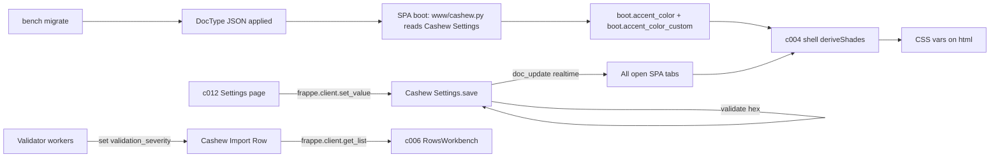

# c013 — schema-additions

> **Type:** doctype-change
> **Depends on:** (none — pure DocType JSON edits)
> **Arch refs:** D13 (3 approved additions), D13/D14 Amendment 1 in
> `arch/decisions-b.md` (Custom accent escape hatch), D14 (theming pipeline)
> **Sequencing:** ships ahead of c004 (shell consumes accent fields at boot)
> and ahead of c012 (Settings page writes accent fields).

---

## Overview

Four additive DocType field changes across three DocTypes, plus one validator
hook on `Cashew Settings`. Unlocks SPA theming (with custom hex escape hatch),
per-run operator notes, and row-level validation severity tagging. No data
backfill — all new fields are optional with blank defaults for existing rows.

Single `bench migrate` applies all changes.

---

## Field additions

### 13.1 — `Cashew Settings.accent_color`

| Property | Value |
|---|---|
| DocType | `Cashew Settings` (Single) |
| Fieldname | `accent_color` |
| Fieldtype | `Select` |
| Options | `Indigo\nTeal\nBurnt Orange\nMonochrome\nCyan\nCustom` |
| Default | `Indigo` |
| Required | 0 |
| Placement | Append after `company`, before mapping table fields |
| Description | "Theme accent for the Cashew SPA. Pick a curated preset or 'Custom' to provide your own hex (see Custom Hex field below)." |

### 13.1b — `Cashew Settings.accent_color_custom`

| Property | Value |
|---|---|
| DocType | `Cashew Settings` (Single) |
| Fieldname | `accent_color_custom` |
| Fieldtype | `Data` |
| Default | (empty) |
| `depends_on` | `eval:doc.accent_color=='Custom'` |
| `mandatory_depends_on` | `eval:doc.accent_color=='Custom'` |
| Placement | Immediately after `accent_color` |
| Description | "Custom hex color (e.g. `#3b82f6`). Used only when Accent Color is 'Custom'. Six-digit hex including the leading `#`." |
| Validator | Server-side regex `^#[0-9a-fA-F]{6}$` in `Cashew Settings.validate()` (see Controller change below) |

### 13.2 — `Cashew Import Run.notes`

| Property | Value |
|---|---|
| DocType | `Cashew Import Run` |
| Fieldname | `notes` |
| Fieldtype | `Long Text` |
| Default | (empty) |
| Required | 0 |
| Placement | Append after `diagnostics_file`, inside a new Section Break (see below) |
| Description | "Freeform operator notes for this import run. Editable at any lifecycle stage." |

**Section Break that wraps it:**
- Fieldname: `notes_section` (or next available auto-incremented section break id)
- Fieldtype: `Section Break`
- Label: `Operator Notes`
- `collapsible`: 1
- `collapsible_depends_on`: `eval:!doc.notes`  (collapsed when empty, auto-expands when content present)
- Placement: immediately after `diagnostics_file`, before the `notes` field

### 13.3 — `Cashew Import Row.validation_severity`

| Property | Value |
|---|---|
| DocType | `Cashew Import Row` |
| Fieldname | `validation_severity` |
| Fieldtype | `Select` |
| Options | `Error\nWarning\nInfo` |
| Default | `Error` |
| Required | 0 |
| `depends_on` | `eval:doc.validation_status=='Error'` (Desk form only; SPA reads via API regardless) |
| `read_only` | 1 (set by server-side validators, not user-editable) |
| Placement | Immediately after `validation_status` |
| Description | "Severity of the validation result. Error blocks validate/queue. Warning/Info are advisory only." |

**Default rationale:** existing rows with `validation_status='Error'` retain
hard-block behavior because `validation_severity` defaults to `Error`. Future
validator classes may emit `Warning` or `Info` instead of `Error`; the
workbench (c006) renders Warning rows as queueable, Error still blocks queue_run.

---

## Controller change (`Cashew Settings.validate`)

`cashew_integration/cashew_integration/doctype/cashew_settings/cashew_settings.py`:

```python
import re

class CashewSettings(Document):
    def validate(self):
        # ... existing validate body ...
        self._validate_accent_color()

    def _validate_accent_color(self):
        if self.accent_color == "Custom":
            value = (self.accent_color_custom or "").strip()
            if not re.match(r"^#[0-9a-fA-F]{6}$", value):
                frappe.throw(
                    _("Custom Accent Color must be a 6-digit hex like #3b82f6"),
                    title=_("Invalid Accent Color"),
                )
            self.accent_color_custom = value  # normalize trimmed value
        else:
            # Clear stale custom hex when switching back to a preset
            self.accent_color_custom = None
```

Notes for Dev:
- If `cashew_settings.py` already has `validate()`, append `self._validate_accent_color()` to its body — do not overwrite the existing method.
- Add `import re` at top if not already imported.
- Use `_` from `frappe` for translation; existing controller likely already imports it.

---

## Data flow



Lifecycle:
- **Reads** for `accent_color` / `accent_color_custom`: SPA boot via
  `frappe.db.get_single_value('Cashew Settings', '<field>')` injected into
  `window.boot`.
- **Writes** for accent fields: Settings page c012 via
  `frappe.client.set_value('Cashew Settings', 'Cashew Settings', {accent_color, accent_color_custom})`
  per D5.1. The validator above runs server-side as part of the save.
- **Realtime:** `Cashew Settings` doc_update event (already emitted by Frappe
  on save) propagates the new values to other open SPA tabs (D14 + D8). Shell
  re-applies CSS vars on event.
- `Cashew Import Run.notes`: read/write via `frappe.client.get_doc` /
  `frappe.client.set_value` (D5.1); SPA c006 CompletedSummary exposes an
  editable textarea.
- `Cashew Import Row.validation_severity`: read-only via SPA. Set
  exclusively by server-side validators (existing code path that emits
  `validation_status` extends to emit `validation_severity` in parallel).

---

## Permissions

| Field | Read perm | Write perm |
|---|---|---|
| `Cashew Settings.accent_color` | Cashew Settings read (System Manager, Accounts Manager) | Cashew Settings write |
| `Cashew Settings.accent_color_custom` | same as above | same as above |
| `Cashew Import Run.notes` | inherits Cashew Import Run perms (Cashew Operator+) | inherits same |
| `Cashew Import Row.validation_severity` | inherits Cashew Import Row perms | `read_only=1` — server-set only |

No new doctype perms, no new role fixtures. Per-field perms (`Permlevel`)
remain at 0 for all four fields. Cross-ref: `system-arch/permissions.md`.

---

## Files touched by Dev

```
cashew_integration/cashew_integration/doctype/cashew_settings/cashew_settings.json
cashew_integration/cashew_integration/doctype/cashew_settings/cashew_settings.py
cashew_integration/cashew_integration/doctype/cashew_import_run/cashew_import_run.json
cashew_integration/cashew_integration/doctype/cashew_import_row/cashew_import_row.json
```

No new files. No hooks.py changes. No fixtures.

---

## Dev recipe (minimal)

1. **Edit JSON files** — add fields at the indicated positions. Bump `idx`
   for any field after each insertion point. Run
   `bench --site {site} reload-doctype "Cashew Settings"` etc. after each
   to catch syntax errors early.
2. **Add validator** in `cashew_settings.py` — `_validate_accent_color`.
   Add `import re` if missing.
3. **`bench --site {site} migrate`** — applies the schema changes.
4. **Smoke checks** — see Acceptance below.

---

## Acceptance

- [ ] `bench migrate` completes without error on a fresh site and on an
      existing site with Cashew data already loaded.
- [ ] Desk form for `Cashew Settings` shows `Accent Color` (Select with 6
      options) and `Custom Hex` (Data) — `Custom Hex` only visible when
      `Accent Color == "Custom"`.
- [ ] Saving Cashew Settings with `accent_color='Custom'` and an invalid hex
      (`xyz`, `#abc`, `#1234567`, empty) raises a clear validation error.
- [ ] Saving with `accent_color='Custom'` and `accent_color_custom='#3b82f6'`
      succeeds; subsequent switch to a preset clears the stored custom hex.
- [ ] Desk form for an existing `Cashew Import Run` shows a collapsed
      "Operator Notes" section after `Diagnostics File`; expanding reveals
      the empty `notes` Long Text. Saving with content persists.
- [ ] Desk form for `Cashew Import Row`: rows with `validation_status='Error'`
      show the new `Validation Severity` field (default `Error`); rows with
      any other validation_status hide the field.
- [ ] `Validation Severity` is read-only in the Desk form (no inline edit
      available to users).
- [ ] All four new fields are exposed via `frappe.client.get_doc` /
      `get_list` without explicit fieldnames request (default behavior).

---

## Open items (deferred to consuming components)

- Exact preset → hex table (Teal / Burnt Orange / Cyan) — finalized in c004
  spec where the shade table actually lives in code.
- Shade derivation function for Custom — c004 spec.
- Operator Notes UI surface in SPA (collapsed by default? word count?) — c006
  CompletedSummary spec.
- Validation-severity facet UX (filter chip, sort, badge color) — c006
  RowsWorkbench spec.

---

## Notes for the reader

This component is intentionally tiny by design — it is the bedrock that c004,
c006, and c012 sit on. Keeping it as pure schema (no API endpoints, no
hooks.py changes, no fixtures) means Dev can land it in a single commit and
unblock the rest of the feature work immediately.
