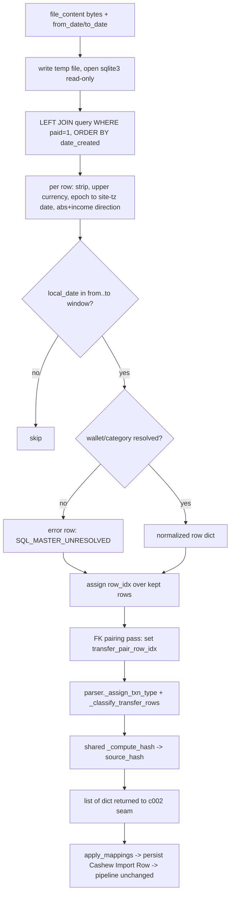

# c001 — SQLite Reader

> Feature: f011 Cashew SQL (SQLite) Import
> Built on `arch/decisions.md`: *Reuse the Entire Pipeline — Only the Reader Is New*,
> *source_hash Parity Is the Correctness Crux*, *Transfer Pairing by paired_transaction_fk*,
> *LEFT JOIN + Error Row, Never Silent Drop*, *Timezone parity (§5.6)*.
> Detail source: `arch/sql-import-plan.md` §2–§5.

## Overview

A new module `cashew_integration/importer/sqlite_reader.py` exposing
`read_sqlite(file_content, company_currency, from_date=None, to_date=None)`. It reads a
Cashew SQLite backup and returns the **exact same `list[dict]`** that `parser.parse_csv`
returns. It is the only new code path in the feature: once these row dicts are persisted as
`Cashew Import Row` children (by c002's seam), mapping, validation, idempotency, posting,
diagnostics, and the SPA all run **unchanged**.

The one hard requirement is **`source_hash` parity** — the same transaction read from CSV
and from SQL must hash identically, or "add alongside" double-posts. Every normalization
rule below exists to hold that parity.

## Component detail

- **id:** c001
- **name:** sqlite-reader
- **type:** python-module (importer) — no DocType, no whitelisted endpoint of its own
- **depends_on:** [] — pure function. (c002 calls it; c003 tests it.)
- **file:** `cashew_integration/importer/sqlite_reader.py`

### Prerequisite refactor (in scope for c001 — do this first)

`parser._compute_hash` must be extracted into a **shared helper** that both `parse_csv` and
`read_sqlite` import and call. One hash implementation, two callers = parity insurance.
Suggested: move it to a small shared location (e.g. `importer/hashing.py` or keep in
`parser.py` and import it into the reader). Do **not** copy/re-implement the hash payload in
the reader — a divergent copy is exactly the failure mode c003 guards against.
This mutates existing `parser.py`; call it out in the diff. No behavior change to CSV.

### Reader query

LEFT JOIN wallet + category + sub_category; `WHERE paid = 1`; deterministic order.

```sql
SELECT t.transaction_pk, t.name, t.amount, t.note, t.income, t.date_created,
       t.paired_transaction_fk,
       w.name AS account, w.currency,
       c.name AS category, sc.name AS sub_category
FROM transactions t
LEFT JOIN wallets    w  ON t.wallet_fk       = w.wallet_pk
LEFT JOIN categories c  ON t.category_fk     = c.category_pk
LEFT JOIN categories sc ON t.sub_category_fk = sc.category_pk
WHERE t.paid = 1
ORDER BY t.date_created, t.transaction_pk;
```

- **LEFT JOIN is mandatory. INNER JOIN is forbidden** — it silently omits any `paid=1` row
  whose wallet/category was deleted, re-creating the exact omission bug this feature fixes.
- `WHERE paid = 1` is the balance-scope filter — excludes the single unpaid/upcoming future
  txn (`type=2`, dated 2026-07-13) Cashew does not count toward balance. Keeps already-paid
  reoccurring instances.
- Open the DB from `file_content` bytes. `sqlite3` needs a file path or URI — write the
  bytes to a temp file (or `tempfile.NamedTemporaryFile`) and open **read-only**
  (`file:...?mode=ro`, `uri=True`); clean the temp file up in a `finally`.

### Date-window filter (per user decision 2026-07-04 — "user-chosen date window")

`read_sqlite` accepts optional `from_date` / `to_date` (ISO `YYYY-MM-DD`, **site-local**
calendar dates as the user reads them). Semantics:

- Filter is **inclusive** on both ends: keep a row when `from_date <= local_txn_date <= to_date`.
- Apply the filter on the **site-local date** derived from `date_created` (the same tz
  conversion used to build `txn_date`) — **not** on the raw UTC epoch. This guarantees the
  window matches the dates the user sees in Cashew and in the SPA. (Doing an epoch-range
  comparison in SQL risks off-by-one-day at the tz boundary — filter in Python after the
  epoch→local conversion, over the ~hundreds of rows, and it is exact.)
- **Both optional.** `from_date=None` → no lower bound; `to_date=None` → no upper bound.
  Blank/blank = whole DB (the full-backfill path). Empty result set is valid (a run with 0
  rows parses fine).
- Guard: if both present and `from_date > to_date`, raise a clear error (surface at the seam
  / on the run, not a silent empty import).

### Per-row normalization (all parity-critical — a miss double-posts)

Emit one dict per surviving row with **every** key in `sql-import-plan.md §2`. The
transforms that must be exact:

| dict key | source | rule |
|---|---|---|
| `raw_account` | `w.name` | `.strip()` |
| `raw_amount` | `t.amount` (REAL, **signed**) | `round(abs(amount), 2)` |
| hash amount | `t.amount` | `str(round(abs(amount), 10))` — **full precision**, not the 2dp `raw_amount` |
| `source_currency` | `w.currency` | **`.upper()`** — DB stores lowercase `pkr`/`usd`; CSV exports `PKR`/`USD` |
| `title` | `t.name` | `.strip()` |
| `note` | `t.note` | `.strip()`, **keep interior `\n`** (transfer regex needs it) |
| `income_flag` | `t.income` (INT 0/1) | lowercase string `"true"` if 1 else `"false"` |
| `category` | `c.name` | verbatim |
| `sub_category` | `sc.name` | `""` when fk null (0 rows use it in the scanned file; still resolve generally) |
| `txn_date` / `raw_txn_time` | `t.date_created` (**UTC Unix seconds**) | convert epoch → **site tz `Asia/Karachi`** (`System Settings.time_zone`) **then** `.date()` / `.time()` |
| `month_key` | derived | `"%Y-%m"` of the site-local datetime |
| `row_idx` | assigned | 1-based over the ordered result set |
| `exchange_rate` / `base_amount` | derived | `1.0` / `raw_amount` when `source_currency == company_currency`, else `None` / `0.0` (mapping fills the rest) |
| `source_hash` | all above | **shared `_compute_hash`** — never a reimplementation |

- **Amount direction** comes from the `income` column, **not** the sign of `amount` (income=0
  ⇒ amount<0). Take `abs`, read direction from `income`.
- **Timezone is the #1 parity trap.** `date_created` is UTC seconds; Cashew's CSV exports
  device-local time. `1738708920` = `2025-02-04 22:42 UTC` = **Feb 5** in PKT (UTC+5). Convert
  with the Frappe site timezone before `.date()`, or `txn_date` (a hash field) drifts a day
  for late-night txns and every cross-source hash for them diverges.

### Master-unresolved → error row (never drop)

If `account` (wallet) or `category` is NULL after the LEFT JOIN, do **not** drop the row.
Emit it with `validation_status="Error"`, `validation_error_code="SQL_MASTER_UNRESOLVED"`,
and a message naming the missing master + `transaction_pk`. Surfaced in diagnostics like any
other error row. (Scan: 0 orphans today — the reader must not depend on that.)

### Transfer pairing — FK-driven (deliberate divergence — call out in code)

**Named divergence from "the reader is the only new code":** on the SQL path, transfer legs
are paired by the DB's `paired_transaction_fk`, **not** by the CSV path's note+time
heuristic. Reason: CSV pairs by nearest `raw_txn_time` at second-resolution (never by amount
— FX legs differ), so repeated same-note same-day transfers can mis-pair silently, and
because a transfer JV balances "by construction", a mis-pair posts a **balanced-but-wrong**
JV that c003's per-row hash gate cannot catch. The DB link is authoritative.

Reader responsibility (a pass over the full row list after per-row mapping):

- `paired_transaction_fk` present **and resolves** to an in-file row → set
  `transfer_pair_row_idx` on **both** legs from the FK; internal transfer (route
  `Transfer JV`). (Scan: 30 of 31 resolve.)
- present **but dangling** (partner not in file) → **External Transfer** (route
  `External Transfer JE`). (Scan: exactly 1 — `Saving → Meezan Bank`.)
- **absent** on a `Transferred Balance` leg → existing classifier fallback (external /
  incomplete).

Then call the parser's **existing** `parser._assign_txn_type` and
`parser._classify_transfer_rows` over the list for `txn_type`/route assignment and note
parsing + external/adjustment routing. Pairing is the only decision the reader overrides;
routing and posting stay shared. Do **not** rewrite the classifier.

## Data flow



## Permissions

None new. `read_sqlite` runs inside `api.parse_and_preview`, which is already permission-
gated on the `Cashew Import Run`. The reader touches no docs directly.

## Notes / gotchas

- `sqlite3` is stdlib — no new dependency. Open **read-only**; never write to the uploaded DB.
- Accept only the intended masters; ignore `budgets`, `tags`, `objectives`, `delete_logs`,
  `app_settings` (`delete_logs` is a sync tombstone table, **not** a filter to apply — the
  `transactions` table already excludes hard-deleted rows).
- Reuse over reinvent: `_assign_txn_type`, `_classify_transfer_rows`, and the shared hash
  helper. The reader owns only: SQL, per-row type normalization, the date window, and FK
  pairing.
- c003 (the gate) proves per-row hash parity **and** transfer posting — build the reader so a
  fixed sample is reproducible (deterministic order already gives this).

status: draft-for-dev
