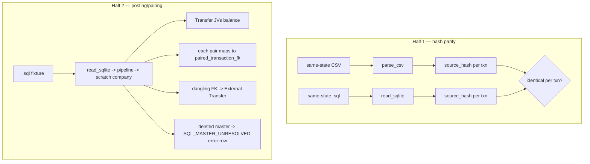

# c003 — source_hash parity test (GATE)

> Feature: f011 Cashew SQL (SQLite) Import
> Built on `arch/decisions.md`: *source_hash Parity Is the Correctness Crux*,
> *Gate Scope — hash parity ≠ pairing/posting*.
> Detail source: `arch/sql-import-plan.md` §3, §5.5, §5.6.

## Overview

The safety gate for "add alongside". An automated test suite that proves the SQL reader is
safe to run next to the CSV path. It has **two halves** — do not ship on the first alone:

1. **Hash parity (dedup safety):** the same transactions read via CSV and via SQL produce
   **identical** `source_hash` per transaction. This is what lets the idempotency guard
   collapse cross-source duplicates into one posting.
2. **Posting correctness (pairing safety):** every internal Transfer JV balances, and each
   posted transfer pair maps to a real `paired_transaction_fk` link.

**A green half-1 says nothing about pairing** — a mis-paired transfer still hashes fine.
Both halves are required before add-alongside is trusted.

## Component detail

- **id:** c003
- **name:** source-hash-parity-test
- **type:** test-suite (`tests/` in `cashew_integration`)
- **depends_on:** [c001, c002] — exercises the reader through (or parallel to) the seam.

### Half 1 — golden hash parity

- **Ideal fixture:** a CSV **and** a `.sql` exported from the **same Cashew state**. Take the
  transactions present in both, run `parse_csv` and `read_sqlite`, assert `source_hash` is
  identical per transaction (match on a stable natural key, e.g. date+title+amount+account).
- **Fixture caveat (state this in the test + handoff):** the provided `.sql`
  (`cashew-2026-07-04-…sql`) alone is **not sufficient** — parity needs a CSV of the *same*
  DB state. Dev must export a CSV from that same Cashew DB (Cashew Settings → Export) to run
  the true cross-source assertion.
- **Fallback when no matching CSV exists:** assert the SQL reader's `source_hash` for a
  **fixed hand-picked sample** against **hand-computed expected hash values** (compute the
  canonical JSON payload from `sql-import-plan.md §3` by hand for ~5 representative rows:
  one income, one expense, one transfer leg, one FX, one with a `\n` note). Mark clearly that
  this is the fallback, not the full cross-source proof.

Assertions that specifically catch the known parity traps (each should have a row that would
fail if the transform were wrong):
- currency uppercased (`pkr`→`PKR`) — a lowercase row must hash-match the CSV's uppercase.
- **timezone**: a **late-night UTC txn** (e.g. `date_created` ≈ 22:4x UTC) must land on the
  **next local day** in `txn_date` and still hash-match the CSV. This is the highest-signal
  single assertion — if tz is wrong, only late-night rows diverge.
- full-precision amount (a value with >2 decimal places of significance) hashes on the 10dp
  form, not the 2dp `raw_amount`.
- trailing-whitespace account/title/note stripped identically.
- `income_flag` lowercase `"true"`/`"false"`.

### Half 2 — posting / pairing correctness

- Feed the real `.sql` (or a crafted fixture DB with known transfers) through the reader +
  pipeline into a scratch company; then assert:
  - every posted internal **Transfer JV balances** (debits = credits; rate 1.0 for
    same-currency legs, implied rate for FX).
  - each posted transfer **pair's two legs correspond to a `paired_transaction_fk` link**
    (the FK-driven pairing from c001 §5.5 held).
  - the one **dangling FK** case routes to **External Transfer**, not a broken internal JV.
- `SQL_MASTER_UNRESOLVED`: a fixture row with a deleted wallet/category must appear as an
  **error row**, never dropped (guards the LEFT-JOIN contract).
- Date window: a `read_sqlite(..., from_date, to_date)` call returns only rows whose
  **site-local** date is inside the inclusive window; a late-night boundary row lands on the
  correct side (same tz logic as the hash test).

### Test scope note (must be written into the suite docstring)

State plainly: **"hash parity green ≠ transfers post correctly."** Half 1 proves dedup
parity only. Half 2 is the pairing/posting guard. A reviewer reading a green run must not
conclude the books are correct from Half 1 alone.

## Data flow

## Permissions

Test-only. Runs in the bench test runner against a scratch site/company. No production
permission surface.

## Notes / gotchas

- This component is the **GATE** in `feature.yaml` — until both halves pass, add-alongside is
  unsafe and must not be enabled on real data.
- Prefer `frappe`-style tests (`bench --site <site> run-tests --app cashew_integration`) so
  the pipeline (mapping/idempotency/posting) runs the same code as production.
- Keep the sample deterministic (reader already orders by `date_created, transaction_pk`) so
  hand-computed expected hashes stay stable across runs.
- Precondition reminder (from arch): parity/posting green only certifies dedup + pairing. It
  does **not** certify that any prior CSV run posted correct values — if CSV posted *wrong*
  values, add-alongside leaves them (double-count); that is an f004-revert decision, out of
  scope for this test.

status: draft-for-dev
